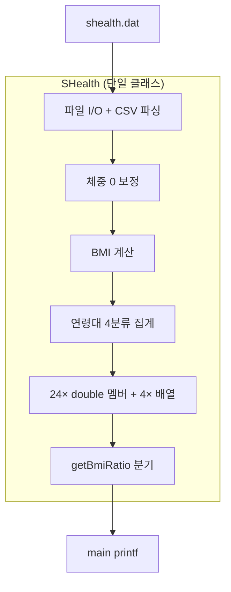

# SHealth BMI — 코드 품질 분석서 (SOLID & Code Smell)

| 항목 | 내용 |
|------|------|
| 문서 버전 | 1.0 |
| 작성일 | 2026-05-20 |
| Step | 03 — 코드 품질 분석 |
| 입력 | README.md, SHealth.h/cpp, SHealthBMI.cpp, `docs/requirements_analysis.md`, `.cursorrules` |
| 후속 Step | 04 1차 리팩토링, 05~06 단위 테스트, 07 결함 분석, 08~11 SRP·기능 개선 |
| 코드 변경 | **없음** (분석 전용) |

---

## 1. 개요

### 1.1 분석 범위

| 파일 | 역할 | 분석 초점 |
|------|------|-----------|
| `SHealth.h` | 단일 God Class 인터페이스·24 통계 멤버·고정 배열 | 데이터 모델, 캡슐화 |
| `SHealth.cpp` | CSV I/O, 보정, BMI, 연령대 통계, `getBmiRatio` | SRP, Long Method, 중복, 경계 |
| `SHealthBMI.cpp` | main, 6연령대 `printf` | 프레젠테이션 결합, 중복 출력 |
| `SHealthBMITest.cpp` | `FailedTest` placeholder | 테스트 부재 (Step 06) |

### 1.2 아키텍처 스냅샷 (As-Is)



**핵심 진단:** 도메인(건강 통계), 인프라(파일), 알고리즘(보정·분류), 집계·저장, 조회 API, UI 출력이 **한 클래스·한 메서드 체인**에 혼재한다.

---

## 2. SOLID 원칙 위반 분석

### 2.1 SRP — Single Responsibility Principle (심각)

**원칙:** 클래스는 변경 이유가 하나여야 한다.

**현황:** `SHealth`는 최소 **6가지 책임**을 동시에 가진다.

| # | 책임 | 위치 | 변경 유발 요인 |
|---|------|------|----------------|
| 1 | CSV 파일 읽기·파싱 | `calculateBmi` L7–26, `split` | 파일 형식, 인코딩, 컬럼 |
| 2 | 체중 0 연령대 보정 | L28–48 | 보정 규칙, height=0 추가 |
| 3 | BMI 산출 | L50–53 | 공식, 단위 |
| 4 | BMI 4분류·연령대 집계 | L55–107 | 경계값, 연령 구간 |
| 5 | 통계 결과 저장·조회 | 24 멤버 + `getBmiRatio` | 연령대·분류 확장 |
| 6 | (암묵) 레코드 저장소 | `ages/heights/weights/bmis[10000]` | 용량, STL 전환 |

**증거 — `calculateBmi`가 파이프라인 전체를 수행:**

```6:108:src/main/cpp/SHealth.cpp
int SHealth::calculateBmi(const std::string& filename) {
    count = 0;
    std::ifstream file(filename);
    // ... 로드 ...
    // ... 보정 ...
    // ... BMI ...
    // ... 통계 ...
    return count;
}
```

**영향:** FR-S02(height=0 보정) 추가 시 `calculateBmi`만 다시 커짐. 파일 형식 변경 시 BMI 로직과 동시에 리스크.

**Step 04 권장 방향 (개념):** `CsvReader` / `RecordStore` / `WeightImputer` / `BmiCalculator` / `AgeBandStatistics` 등 **private 함수 추출**로 1차 완화 → Step 08에서 클래스 분리.

---

### 2.2 OCP — Open/Closed Principle (심각)

**원칙:** 확장에는 열려 있고 수정에는 닫혀 있어야 한다.

**위반 1 — 연령대 확장 시 수정 지점 다중화**

| 확장 시나리오 | 수정 필요 위치 |
|---------------|----------------|
| 80대 추가 | `for (a=20; a<=70; a+=10)` 3곳, `if (a==20)…else if (a==70)` 블록, `getBmiRatio` 4분기×N, `SHealth.h` 멤버 +4종, `SHealthBMI.cpp` printf 1행 |

**증거 — 연령대별 멤버 할당 중복 (6× 동일 패턴):**

```76:106:src/main/cpp/SHealth.cpp
        if (a == 20) {
            underweight20 = (double)underweight * 100 / sum;
            // ...
        } else if (a == 30) {
            underweight30 = (double)underweight * 100 / sum;
            // ...
        } // ... 60, 70 동일 ...
```

**위반 2 — BMI 분류 타입 확장**

- `type` 100/200/300/400은 `getBmiRatio`에 **하드코딩 24분기** (L111–136).
- 새 분류(예: “경도 비만”) 추가 시 분기·멤버·main 출력 모두 수정.

**위반 3 — 분류 경계 변경**

- BMI 임계값이 `calculateBmi` 내부 if-else에만 존재 → 상수화·전략 패턴 없음.

**Step 04 권장:** `AgeBand` 루프 + `std::map` 또는 `struct AgeBandStats { double uw, nw, ow, ob; } stats[6]`로 **데이터 기반** 전환 (OCP 1차 개선).

---

### 2.3 LSP — Liskov Substitution Principle (해당 약함)

상속·다형성이 없어 **직접 위반은 없음**. 다만 `getBmiRatio`가 “조회 API”처럼 보이나 잘못된 인자에 **항상 0.0**을 반환해, 호출자가 실패와 “실제 0%”를 구분할 수 없음 → **계약 위반**(요구 I-08).

---

### 2.4 ISP — Interface Segregation Principle (중간)

**원칙:** 클라이언트는 사용하지 않는 메서드에 의존하지 않아야 한다.

**현황:** 공개 API는 2개뿐이나, `calculateBmi` 한 번 호출로 **전체 파이프라인·전체 통계**가 강제된다.

| 클라이언트 니즈 | As-Is | 문제 |
|-----------------|-------|------|
| BMI만 재계산 | 불가 (항상 파일부터) | 불필요한 I/O |
| 특정 연령대만 | 불가 | 전체 6구간 항상 계산 |
| id 목록만 (FR-C01) | id 미파싱·미저장 | API 확장 불가 |

**향후:** 좁은 인터페이스(`IBmiClassifier`, `IAgeBandReporter`) 분리는 Step 08 이후.

---

### 2.5 DIP — Dependency Inversion Principle (중간)

**원칙:** 고수준 모듈은 저수준 구현에 의존하지 않는다.

**현황:** `SHealth`가 `std::ifstream`, 파일 경로 문자열, CSV `split`에 **직접 결합**. 테스트 시 파일 없이 로직 검증하려면 `calculateBmi` 전체를 호출하거나 리팩토링 필요.

**향후:** `std::istream` 또는 `loadFromRecords(vector<Record>)` 주입 (Step 05~06 테스트와 연계).

---

### 2.6 SOLID 요약 매트릭스

| 원칙 | 심각도 | 핵심 위반 |
|------|--------|-----------|
| **SRP** | 높음 | `calculateBmi` + God Class |
| **OCP** | 높음 | 연령대·type·경계 확장 시 분기·멤버 증가 |
| LSP | 낮음 | 상속 없음; API 0.0 모호성 |
| **ISP** | 중간 | 일괄 처리 API, id 미노출 |
| **DIP** | 중간 | 파일 I/O 직접 결합 |

---

## 3. 코드 스멜 (Code Smells) 상세

### 3.1 README Activity 1 「코드 스멜 찾기」 매핑

| README Activity 1 항목 | 코드 스멜 (정식 명칭) | 위치 | 설명 |
|------------------------|----------------------|------|------|
| 기본 코드구조 이해 | **God Class** | `SHealth` 전체 | 모든 상태·로직이 한 클래스 |
| | **Feature Envy** (경미) | 연령대 루프 | 동일 `ages[i]` 조건이 3회 반복 |
| BMI 로직 이해 | **Magic Number** | 분류 18.5, 23, 25; `/100`; type 100~400 | named constant 없음 |
| | **Primitive Obsession** | `ageClass`, `type` int | enum·도메인 타입 부재 |
| 코드 스멜 찾기 | **Long Method** | `calculateBmi` (~103줄) | 로드·보정·BMI·통계 일체 |
| | **Duplicate Code** | 연령대 루프 3회; `a==20…70` 할당 6회; `getBmiRatio` 24분기 | DRY 위반 |
| | **Data Clumps** | `ages`, `weights`, `heights`, `bmis` | 항상 동일 인덱스 `i`로 접근 |
| | **Data Clumps** | `underweight20`…`obesity70` 24개 | (ageClass, category) 쌍의 폭발 |
| | **Large Class** | `SHealth.h` | 멤버 4배열 + 24 double + count |
| | **Comments as deodorant** (경미) | 한글 주석만 존재 | 의도는 있으나 구조 분리 없음 |
| (암묵) | **Shotgun Surgery** | 80대 추가 시 | 5+ 파일/영역 동시 수정 |
| (암묵) | **Divergent Change** | 보정 규칙 변경 | `calculateBmi` 전체 재검토 |

---

### 3.2 스멜별 상세

#### 3.2.1 Long Method — `calculateBmi`

| 구간 | 줄(대략) | 책임 |
|------|----------|------|
| 파일 오픈·파싱 | 7–26 | I/O |
| 체중 보정 | 28–48 | Imputation |
| BMI 계산 | 50–53 | Formula |
| 통계 집계·저장 | 55–107 | Aggregation |

**리스크:** 단위 테스트가 함수 단위로 불가능(Step 05 전).

---

#### 3.2.2 Duplicate Code

**패턴 A — 동일 연령대 필터 (3회)**

```29:47:src/main/cpp/SHealth.cpp
    for (int a = 20; a <= 70; a += 10) {
        // pass 1: 평균 계산
        for (int i = 0; i < count; i++) {
            if (ages[i] >= a && ages[i] < a + 10) { ... }
        }
        // pass 2: 보정 적용
        for (int i = 0; i < count; i++) {
            if (ages[i] >= a && ages[i] < a + 10) { ... }
        }
    }
```

```56:75:src/main/cpp/SHealth.cpp
    for (int a = 20; a <= 70; a += 10) {
        // pass 3: 분류 카운트
        for (int i = 0; i < count; i++) {
            if (ages[i] >= a && ages[i] < a + 10) { ... }
        }
```

**추출 후보:** `isInAgeBand(age, a)`, `forEachInAgeBand(a, lambda)`.

**패턴 B — `getBmiRatio` 24-way 분기**

```111:136:src/main/cpp/SHealth.cpp
double SHealth::getBmiRatio(int ageClass, int type) {
    if (ageClass == 20 && type == 100) return underweight20;
    // ... 22개 else if ...
    return 0.0;
}
```

**패턴 C — `SHealthBMI.cpp` main 출력 6회 복제**

```8:25:src/main/cpp/SHealthBMI.cpp
    printf("20 - underweight = %f, ...\n", ...);
    // 30, 40, 50, 60, 70 동일 구조
```

---

#### 3.2.3 Magic Number

| 값 | 의미 | 권장 이름 (Step 04) |
|----|------|---------------------|
| 18.5, 23, 25 | BMI 경계 | `BMI_UNDERWEIGHT_MAX`, `BMI_NORMAL_MAX`, `BMI_OVERWEIGHT_MAX` |
| 100 | cm→m | `CM_PER_METER` |
| 100, 200, 300, 400 | 분류 type | `enum class BmiCategory` |
| 20, 30, …, 70 step 10 | 연령대 | `MIN_AGE_CLASS`, `AGE_BAND_WIDTH` |
| 10000 | 배열 상한 | `MAX_RECORDS` 또는 `vector` |
| 100 (비율) | 백분율 | `PERCENT_SCALE` |

---

#### 3.2.4 Data Clumps & Primitive Obsession

**레코드 부재:** `id`는 파싱하지 않음(`tokens[0]` 미사용). 레코드는 4개 평행 배열로만 표현.

```12:16:src/main/cpp/SHealth.h
    int ages[10000];
    double heights[10000];
    double weights[10000];
    double bmis[10000];
```

**통계 부재:** 24개 독립 `double` 대신 `AgeBandStats[6][4]` 또는 `map<pair,int,double>`.

---

#### 3.2.5 고정 배열 `[10000]`

| 문제 | 설명 |
|------|------|
| 버퍼 오버플로우 | `count++` 전 검사 없음 (§5.1 NFR, I-06) |
| 캐시·메모리 | 미사용 슬롯 항상 할당 |
| STL 미활용 | README에서 허용한 `vector` 미사용 |

---

#### 3.2.6 기타 스멜

| 스멜 | 위치 | 비고 |
|------|------|------|
| **Dead Code / 미사용** | `tokens[0]` (id) | FR-C01 대비 |
| **Error Handling 부재** | `stoi`/`stod`, 컬럼 수 | 예외 전파 (I-09) |
| **Switch Statements smell** | `getBmiRatio`, `a==20` 체인 | map/테이블로 대체 |
| **Speculative Generality** | 없음 | 과도 추상화 없음 — 양면 |

---

## 4. 경계 조건·결함 가능성 (Correctness)

`docs/requirements_analysis.md` §4.3과 교차 검증.

### 4.1 BMI 분류 경계

| BMI | README | 코드 (`SHealth.cpp` L65–72) | 판정 |
|-----|--------|-------------------------------|------|
| 18.5 | 저체중 | `<= 18.5` | OK |
| 18.5 < x < 23 | 정상 | `> 18.5 && < 23` | OK |
| 23 ≤ x < 25 | 과체중 | `>= 23 && < 25` | OK |
| **25.0** | **비만** | `> 25`만 비만 → **과체중** | **결함 (P0)** |
| 25.001 | 비만 | `> 25` | OK |

**갭 구간:** README에 없는 `18.5 < x <= 18.5` 등은 없음.  
**이중 조건:** `> 18.5 && < 23`에서 `<= 18.5`와 중복 검사는 방어적이나 가독성 저하.

**비교 연산자 불일치 요약:**

```
README 비만:     BMI >= 25
코드 비만:       bmis[i] > 25   ← 25.0 누락
```

### 4.2 연령대 경계

| age | 기대 연령대 | 코드 `ages[i] >= a && ages[i] < a+10` |
|-----|-------------|----------------------------------------|
| 19 | 없음 | 미포함 OK |
| 20 | 20대 | 포함 OK |
| 29 | 20대 | 포함 OK |
| 30 | 30대 | 포함 OK |

### 4.3 보정 로직 경계

| 시나리오 | 동작 | 위험 |
|----------|------|------|
| `weight == 0`, 동 연령대 유효 체중 0건 | `ageCount==0` → `sum/ageCount` = **0/0 → NaN** | P0 (I-02) |
| `height == 0` | 보정 없음 → BMI **inf/NaN** | P1 (I-03) |
| 연령대 내 인원 0 (`sum==0`) | `%` 계산 0/0 | P1 (I-05) |
| `tokens.size() < 4` | 미검사, UB 가능 | P1 (I-09) |
| 빈 줄 | `break`로 **이후 데이터 미읽음** | P2 |

### 4.4 분류 누락 구간 (미분류)

다음은 **어느 분기에도 해당하지 않음** (카운트 누락 → 합계 < 100%):

| 조건 | 예시 |
|------|------|
| `bmis[i] == 23` && `else if (>18.5 && <23)` 실패 | **23.0은 과체중 분기로 OK** |
| `bmis[i] == 25` | 과체중 분기 `>=23 && <25` **false**, 비만 `>25` **false** → **미분류** |
| NaN BMI | 모든 비교 false |

**BMI=25는 이중 버그:** README 불일치 + **미분류 가능**(if 순서에 따라 과체중에도 안 잡힐 수 있음).  
실제 코드: `>=23 && <25`는 25를 제외 → `>25`도 false → **어떤 카운터에도 안 들어감**.

### 4.5 `getBmiRatio` 계약

- 잘못된 `ageClass`/`type` → `0.0` (실패·진짜 0% 구분 불가).
- `calculateBmi` 미호출 시 초기값 0.0.

---

## 5. 응집·결합·테스트 용이성

| 지표 | 평가 | 근거 |
|------|------|------|
| 응집도 | **낮음** | 무관 책임이 한 클래스에 공존 |
| 결합도 | **높음** (내부), **낮음** (외부) | 외부 API 2개지만 내부 강결합 |
| 테스트 용이성 | **매우 낮음** | `SHealthBMITest` = `FAIL()` only |
| 관측 가능성 | 중간 | stderr 파일 오류만; 보정 NaN 무로그 |

---

## 6. `SHealthBMI.cpp` (main) 품질

| 이슈 | 설명 |
|------|------|
| 프레젠테이션 로직 | 비즈니스 클래스 + C `printf` 직접 결합 |
| Magic number 반복 | `getBmiRatio(20, 100)` 등 24회 호출 패턴 |
| 경로 하드코딩 | `"shealth.dat"` CWD 의존 (I-12) |
| C++/C 혼용 | `printf` vs iostream (일관성) |

Step 09 Golden Master 확보 전까지 **출력 문자열은 동작 계약**으로 유지 필요.

---

## 7. 요구 분석 이슈 ↔ 코드 스멜 추적

| 이슈 ID | 내용 | 관련 스멜 / SOLID |
|---------|------|-------------------|
| I-01 | BMI=25 | Magic Number, 경계 if — **OCP/SRP** |
| I-02 | 보정 0/0 | Long Method, Error Handling |
| I-03 | height=0 | SRP (보정 책임 추가 시) |
| I-05 | sum==0 | Duplicate loop, 경계 |
| I-06 | 10k 배열 | Primitive Obsession, Large Class |
| I-07 | type 100~400 | Magic Number, `getBmiRatio` |
| I-09 | CSV 예외 | DIP, Long Method |

---

## 8. 리팩토링 우선순위 (P0 / P1 / P2)

### P0 — 정확성·안전 (Step 04~07, 테스트 전/병행)

| ID | 작업 | 근거 | 비고 |
|----|------|------|------|
| P0-1 | BMI **25.0 → 비만** (`>= 25`) | I-01, §4.1 | Golden Master 영향 — Step 09 baseline 갱신 |
| P0-2 | 보정 시 `ageCount==0` 가드 | I-02, NaN 전파 방지 | 0 유지 vs 스킵 문서화 |
| P0-3 | BMI=25 **미분류** 제거 (P0-1에 포함) | §4.4 | |
| P0-4 | (선행) 경계값 **named constants** | Magic Number | 동작 동일 리팩토링 |

### P1 — 1차 클린코드 (Step 04 README Activity 2)

| ID | 작업 | 스멜/원칙 |
|----|------|-----------|
| P1-1 | `calculateBmi` → private 함수 4~5개 추출 | Long Method, SRP |
| P1-2 | 연령대 필터·루프 통합 / `isInAgeBand` | Duplicate Code |
| P1-3 | 24 멤버 → `AgeBandStats` 배열/맵 + `getBmiRatio` 테이블화 | Data Clumps, OCP |
| P1-4 | `enum class BmiCategory`, type 상수 제거 | Magic Number, Primitive Obsession |
| P1-5 | BMI 임계값 `constexpr` | Magic Number |
| P1-6 | `sum==0` 시 0% 또는 early continue | I-05 |
| P1-7 | 네이밍 (`ageClass`→문서화, `count`→`recordCount`) | README Activity 2 |

### P2 — 구조·확장 (Step 08~11)

| ID | 작업 | 스멜/원칙 |
|----|------|-----------|
| P2-1 | `std::vector<HealthRecord>` 전환 | 배열 상한, Data Clump |
| P2-2 | id 파싱·저장 (FR-C01) | Dead field |
| P2-3 | height=0 보정 (FR-S02) | SRP |
| P2-4 | 파일 I/O 분리 / stream 주입 | DIP |
| P2-5 | main 출력 루프화·Presenter 분리 | Duplicate in main |
| P2-6 | 10대·80+ 정책 명시 | OCP |
| P2-7 | CSV 검증·예외 처리 | I-09 |

### P3 — 낮은 우선순위

- `getBmiRatio` 잘못된 인자 예외/optional (I-08)
- CLI 경로 인자 (I-12)

---

## 9. Step 04 권장 작업 목록 (1차 리팩토링)

README Activity 2 순서와 정합. **동작 보존** 전제(단, P0-1은 요구 정합 수정).

| 순서 | 작업 | Activity 2 매핑 | 산출 |
|------|------|-----------------|------|
| 1 | BMI 경계 상수 추출 + **25.0 비만 수정** | 하드코드 제거 | `BmiThresholds` |
| 2 | `classifyBmi(double)` 단일 함수 추출 | 함수 추출 | 분류 단일 진실 공급원 |
| 3 | `isInAgeBand(int age, int bandStart)` | 중복 제거 | 3개 루프 공통화 |
| 4 | `imputeMissingWeightsByAgeBand()` | 함수 추출 | 보정 격리 |
| 5 | `computeBmis()` | 함수 추출 | |
| 6 | `aggregateAgeBandStatistics()` + 24→6×4 구조 | 반복/중복 제거 | `getBmiRatio` 단순화 |
| 7 | `enum class BmiCategory` + `getBmiRatio` map/索引 | Magic Number | |
| 8 | `recordCount` 등 네이밍 | 네이밍 개선 | |
| 9 | main: 연령대 루프 `printf` | 중복 제거 | Golden Master 비교 준비 |

**하지 말 것 (Step 04):** 클래스 파일 분리 다수, height=0, FR-C01/C02 — Step 08~11.

---

## 10. Step 05~06 테스트 연계 (분석만)

| 우선 TC | 검증 대상 | 코드 앵커 |
|---------|-----------|-------------|
| TC-BMI-01 | BMI 공식 (cm→m) | L52 |
| TC-CLS-* | 18.5, 23, **25** 경계 | `classify` 추출 후 |
| TC-IMP-01 | weight=0 보정 | L28–48 |
| TC-IMP-02 | ageCount=0 | P0-2 |
| TC-AGE-* | 19/20/29/30 연령대 | 필터 |
| TC-RATIO | `getBmiRatio` 6×4 | API |
| TC-FILE | 파일 없음 → 0 | L9–11 |

---

## 11. Before / After 목표 (품질 지표)

| 지표 | Before (As-Is) | After (Step 04~08 목표) |
|------|----------------|-------------------------|
| `calculateBmi` LOC | ~103 | < 25 (오케스트레이션만) |
| `getBmiRatio` 분기 수 | 24 | ≤ 6 또는 map O(1) |
| 통계 멤버 수 | 24 doubles | 6 structs 또는 1 map |
| BMI 경계 정의처 | 1곳 (분류 루프) | 1곳 (`classifyBmi`) |
| Magic number (도메인) | 10+ | 0 (named) |
| 단위 테스트 | 0 (FAIL) | 경계·보정 Green |

---

## 12. 결론

현 코드는 **실습용 의도적 안티패턴**이 잘 드러나 있다: 단일 God Class, Long Method, 24-way getter, Magic Number, 평행 배열 Data Clump. SOLID 관점에서는 **SRP·OCP 위반이 핵심**이며, correctness 관점에서는 **BMI=25 미분류·README 불일치가 P0**이다.

Step 04에서는 README Activity 2(네이밍·상수·함수 추출·중복 제거) 범위에서 **구조를 데이터 중심으로 바꾸고 분류·연령 로직의 단일 진실 공급원**을 만드는 것이 최대 효과이다. Step 08에서 SRP에 따른 클래스 분리·DIP·신규 기능(FR-S02, FR-C01/C02)을 이어가면 된다.

---

## 13. 참조

- `docs/requirements_analysis.md` — FR, BMI §4, 이슈 I-01~I-12
- `.cursorrules` — 알려진 스멜, Activities 순서
- README — Activities 1~2, BMI 비즈니스 규칙

## 14. 변경 이력

| 버전 | 일자 | 변경 |
|------|------|------|
| 1.0 | 2026-05-20 | Step 03 초안 작성 |

**다음 Step 입력:** 본 문서 → Step 04 `docs/refactoring_plan.md` (또는 동등 산출물) + P0/P1 작업 실행
