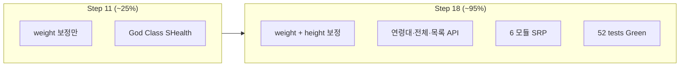

# SHealth BMI — 기능 개선 종합·Activity 5 회고 (Feature Final Report)

| 항목 | 내용 |
|------|------|
| 문서 버전 | 1.0 |
| 작성일 | 2026-05-20 |
| Step | 18 — 기능 개선 종합·Activity 5 회고 갱신 |
| commit string (권장) | `18_기능_개선_종합_Activity5_회고` |
| Persona | QA·기술 리드 (발표·회고 담당) |
| 입력 | Steps 12~17, `docs/qa_final_report.md` v1.0, README Activities 4~5 |
| 선행 | Step 11 QA 종합(As-Is 기준선), Step 17 회귀 52/52 Green |

---

## 1. Executive Summary

6시간 생성형 AI 실습의 **Activity 4(기능 개선)** 를 Step 13~16에서 완료하고, Step 17에서 **52/52 ctest·Golden 6행 불변**을 확인했다. Step 11 시점 대비 Activity 4 달성도는 **약 25% → 약 95%**(DEF-011 문서·CLI 잔여 제외)로 상승했다.

| 영역 | Step 11 | Step 18 |
|------|---------|---------|
| Must (FR-01~08) | 달성 | **유지** |
| Should (FR-S01~S03, S04) | 부분 | **S01~S03·S04 달성** |
| Could (FR-C01~C02) | 미착수 | **달성** |
| ctest | 40/40 | **52/52** |
| Activity 4 | ~25% | **~95%** |
| Activity 5 회고 | Step 11 초안 | **본 문서 + `qa_final_report` 부록 B** |

**발표 핵심:** 요구·TC·Golden 삼각형 위에 Activity 4를 **스프린트 단위(P0→P1)** 로 쌓았고, SRP 분리는 **동작 고정 후** 파일 경계로 옮겨 회귀 비용을 최소화했다.

---

## 2. FR-S01~S03, FR-C01~C02 달성도 표

| ID | 요구 (README Activity 4) | 상태 | 근거 (구현·검증) |
|----|---------------------------|------|------------------|
| **FR-S01** | SRP 책임 분리 | **완료** | `SHealthCsvLoader`, `SHealthImputer`, `SHealthDomain`, `SHealthStatistics`, `SHealthPresenter`, `SHealth` Facade (`docs/feature_srp_refactoring.md` §2). Step 16 후 기존 51 unit + Golden **전부 Pass** |
| **FR-S02** | height=0 동연령대 평균 키 보정 | **완료** | `imputeMissingHeightsByAgeBand()` 파이프라인 삽입 (`docs/feature_implementation_notes.md` §13). `TC_HGT_10/11` Pass. `shealth.dat`에 height=0 없어 Golden **불변** |
| **FR-S03** | 연령대 BMI 4분류 비율 API 정비 | **완료** | `getAgeBandRatios(int)` + `getBmiRatio` SSOT 위임 (`§14`). `TC_API_01~04` Pass. main 6행 `%f` 포맷 유지 |
| **FR-C01** | 정상 BMI 사용자 ID 목록 | **완료** | CSV id 파싱·`getNormalBmiUserIds()` (`§15`). `TC_LST_01~03` Pass. Presenter 데모 출력(Golden 비대상) |
| **FR-C02** | 전체 사용자 4분류 비율 | **완료** | `aggregateGlobalBmiStatistics()`, `getGlobalBmiRatios()` (`§15`). `TC_GLB_01~03` Pass. age 19·80+는 연령대 API와 달리 **전체 집계에 포함** |
| *(참고)* **FR-S04** | 단위 테스트·ctest Green | **완료 (Step 06~11)** | Step 18: 51 unit + 1 Golden; Step 13~15에서 **+12 TC** |

### 2.1 부분·미구현·문서 갭

| 항목 | 상태 | 설명 |
|------|------|------|
| **DEF-011** / FR-08 CWD | **부분 (운영)** | `SHealthBMI`가 `shealth.dat`를 CWD 기준으로 로드. `TC_EXC_10`·README로 완화; **CLI/env 경로 미구현** (`defect_list` Open) |
| **defect_list v1.1** | **문서 지연** | DEF-002는 Step 13에서 **기능 해소**·`TC_HGT_*` Green이나 목록은 여전히 Open 표기 — `feature_regression_report.md` §5 권장: v1.2에서 Fixed 반영 |
| **DIP (`istream` 주입)** | **미구현** | FR-S01은 **파일 단위 SRP**까지; `SHealthCsvLoader`는 여전히 파일 경로 결합 |
| **10대·80대 리포트** | **의도적 미구현 (Won't)** | README·요구 `Won't` — 20~70대만 집계 유지 |
| **vector 전환** | **미구현** | `MAX_RECORDS` 고정 배열 유지 (I-06 장기) |

---

## 3. Step 11 로드맵 → Step 18 실제 달성 (Activity 4)

`docs/qa_final_report.md` §7「미완 Activity 4 로드맵」대비:

| 순서 | Step 11 백로그 | Step 18 결과 | Step |
|------|----------------|--------------|------|
| 1 | height=0 보정 (FR-S02) | **완료** — Golden 재캡처 **불필요** | 13 |
| 2 | SRP 클래스 분리 (FR-S01) | **완료** — 6 모듈 + Presenter | 16 |
| 3 | id·정상 목록 (FR-C01) | **완료** | 15 |
| 4 | 전체 4분류 비율 (FR-C02) | **완료** | 15 |
| 5 | CLI 데이터 경로 (DEF-011) | **미완** — 문서·CWD 전제 유지 | — |
| 6 | `vector<HealthRecord>` | **미착수** | — |

**추가 달성 (로드맵에 암시):** FR-S03 명시 API (`getAgeBandRatios`) — Step 14.



---

## 4. Before (Step 11) / After (Step 18) — 코드·테스트·Golden

### 4.1 정량 비교

| 지표 | Before (Step 11) | After (Step 18) | Δ |
|------|------------------|-----------------|-----|
| **ctest** | 40/40 | **52/52** | +12 unit |
| 단위 테스트 | 39 | **51** | +12 (`TC-HGT`, `TC-API`, `TC-LST`, `TC-GLB`) |
| Golden Master | 1 (`TC_GM_01`) | **1 (동일)** | FR-08 6행 baseline **불변** |
| Activity 4 달성 | ~25% | **~95%** | FR-S02~S03, C01~C02, S01 |
| Open 결함 (기능) | DEF-002, DEF-011 | **DEF-011만** (002는 구현·TC상 Fixed) |
| `src/main/cpp` 파일 수 | ~3 (단일 God Class) | **~12** (Types, Loader, Imputer, Domain, Statistics, Presenter, Facade, main) |
| public API | 2 (`calculateBmi`, `getBmiRatio`) | **6** (+ `getAgeBandRatios`, `getNormalBmiUserIds`, `getGlobalBmiRatios`, test hooks) |
| 파이프라인 단계 | 4 (로드·체중보정·BMI·연령집계) | **6** (+ 키보정·전체집계) |
| main stdout (Golden) | 6행 | **6행** (동일) + 데모 2행 (비대상) |

### 4.2 정성 — 코드 품질 (Step 04 기준선 → Step 18)

| 관점 | Step 11 (After Step 04~10) | Step 18 |
|------|----------------------------|---------|
| **SRP** | private 파이프라인 4~5함수, 단일 `SHealth.cpp` | **파일·네임스페이스 단위** 분리; Facade는 오케스트레이션만 |
| **SSOT** | `classifyBmi`, `AgeBandRatios[6]` | + `getAgeBandRatios` / `getGlobalBmiRatios` / imputer 모듈 |
| **OCP** | 6연령대 배열화 | 동일; 80대 확장 시 **Statistics·Presenter·main** 동시 수정 여전히 가능 |
| **DIP** | `ifstream` 직접 결합 | Loader 분리했으나 **파일 경로 결합** 잔존 |
| **테스트 피라미드** | 39 unit + 1 E2E Golden | **51 unit + 1 Golden**; Could 기능은 API TC로 고정 |
| **회귀** | Golden 6행 | **유지** — Step 13~16 후 diff 0 (`docs/feature_regression_report.md` §4) |

Step 04 1차 리팩토링 지표(`calculateBmi` ~103줄 → ~8줄, 24-way getter 제거)는 Step 11 이후에도 **유지**되며, Step 16은 동일 동작을 **모듈 경계**로만 재배치했다.

### 4.3 Golden Master 요약

| 항목 | Step 11 | Step 18 |
|------|---------|---------|
| baseline | `tests/golden/shealth_bmi_stdout.golden.txt` | **동일 파일** |
| 비교 범위 | stdout 6행 | **동일** (Presenter 이후 2행은 파서 제외) |
| FR-S02 영향 | (미구현) | `shealth.dat`에 height=0 없음 → **수치 drift 없음** |
| 갱신 | Step 04 BMI=25 반영 이력 | Step 13~17 **갱신 없음** |
| 신규 출력 검증 | — | FR-C01/C02 → `TC_LST_*`, `TC_GLB_*` (Golden 대신 unit) |

---

## 5. README Activity 5 — 회고 (갱신)

### 5.1 실습 목표와 달성도

| Activity | 목표 | Step 11 | Step 18 |
|----------|------|---------|---------|
| 1 분석·스멜 | 구조·BMI·스멜 | 100% | **100%** |
| 2 1차 리팩토링 | 네이밍·상수·추출 | 100% | **100%** |
| 3 Unit Test | BMI·보정·분류·예외 | 100% | **100%** (+12 TC) |
| 4 기능 개선 | SRP·height·API·목록·전체비율 | ~25% | **~95%** |
| 5 회고·발표 | Before/After·AI·TC | Step 11 초안 | **본 문서·부록 B** |

### 5.2 AI 활용 — 도움·한계 (Step 12~18 추가)

| 단계 | AI 활용 | 효과 |
|------|---------|------|
| 12 설계 | Activity 4 → FR 단위·파이프라인·Golden 분리 전략 | Step 13~17 **범위 크립 방지** |
| 13~15 구현 | 대칭 보정·API 계약·TC ID 매핑 | FR-S02/C01/C02를 설계서와 **1:1** 구현 |
| 16 SRP | 모듈 매트릭스·Facade 잔여 책임 | breaking change 없이 파일 분리 |
| 17 회귀 | ctest 로그·Open 결함 실측 정리 | DEF-002 문서 갭 **조기 발견** |
| 18 종합 | 다문서 인용·Before/After 표 | 발표용 **단일 스토리** |

| 한계 | Step 18 대응 |
|------|----------------|
| defect_list와 구현 상태 불일치 | 회귀 보고서에서 Fixed **실측** 명시; v1.2 갱신 권장 |
| Golden이 FR-C 데모를 덮지 않음 | 설계 단계에서 **비대상** 확정 — unit TC로 보완 |
| 과도한 DIP/vector 제안 | 실습 시간 대비 **파일 SRP**로 타협 |

### 5.3 TC가 기능 개선에 미친 영향

1. **P0 선행:** Step 11에서 `TC_HGT_01/02`가 As-Is를 고정 → Step 13 구현 시 **기대값 변경 범위**가 명확.
2. **Golden 분리:** FR-08 6행만 Golden → height 보정·Presenter 리팩토링 시 **불필요한 baseline 갱신 회피**.
3. **신규 API 고정:** `TC_API_*`가 legacy `getBmiRatio`와 수치 동일성 증명 → main·Golden **무변경** 리팩토링 허용.
4. **Could 기능:** `TC_LST_*`·`TC_GLB_*`가 stdout 데모 없이도 FR-C01/C02 **계약 잠금**.
5. **회귀 게이트:** Step 17에서 52/52 — Activity 4를 **한 번에 머지해도** 안전함이 입증됨.

**TC 작성 팁 (Activity 4 이후):** 기능 Step마다 `docs/test_plan.md` §6 예약 ID를 먼저 배치 → 구현 → Golden 영향 여부를 설계서 §7과 **동시** 판단.

### 5.4 클린코드·리팩토링 체감

**장점**

- **기능 후 구조:** 동작을 TC로 고정한 뒤 Step 16 SRP를 적용해 “움직이는 부품”이 줄어듦.
- **대칭 보정:** weight/height imputer 분리로 README 요구를 **읽기 쉬운 대칭**으로 표현.
- **Facade:** `SHealth` public API는 안정, 내부 모듈 교체·테스트 hook 유지.

**어려운 점**

- **문서 동기화:** DEF-002 Open 표기 vs 구현 완료 — **사람이 defect_list를 한 번 더 갱신**해야 함.
- **Golden 범위:** 데모 2행은 Pass/Fail에 안 잡힘 → **의도적**이지만 발표 시 설명 필요.
- **모듈 수 vs 실습 시간:** DIP·vector까지 가면 Activity 5 시간이 부족 — **우선순위 트레이드오프** 명시 필요.

---

## 6. 잔여 리스크·권장 다음 스프린트

| 우선순위 | 항목 | 설명 | 예상 산출 |
|----------|------|------|-----------|
| P3 | **DEF-011** CLI/env | `argc`/`argv` 또는 env로 `shealth.dat` 경로 | README 실행 절, `TC_EXC_*` 보강 |
| P3 | **defect_list v1.2** | DEF-002 Fixed, ctest 52/52 | 문서만 |
| P2 | **10대·80대** | 비즈니스 요구 시 연령 밴드·main·Golden **6→8행** 확장 | 요구 변경 + baseline 재캡처 |
| P2 | **`vector<HealthRecord>`** | `MAX_RECORDS` 제거, I-06 | `TC_EXC_20` (선택), Loader 리턴 타입 변경 |
| P2 | **DIP** | `istream` / 경로 주입으로 Loader 테스트 용이화 | Mock 없이 temp stream TC |
| P3 | **데모 stdout Golden** (선택) | FR-C01/C02 2행 스모크 또는 Golden 확장 | YAGNI — 현재 unit으로 충분 |

**권장 Sprint C (0.5~1일)**

1. `defect_list.md` v1.2 + README 빌드/실행(CWD) 문단 정리  
2. DEF-011 최소 CLI (`SHealthBMI.exe [path-to-csv]`)  
3. (선택) `HealthRecord` struct + vector — Activity 4 이후 기술 부채

**회귀 게이트 (변경 시 필수)**

```powershell
cd build-gcc
cmake --build .
ctest --output-on-failure
ctest -R SHealthGoldenMaster -V
```

---

## 7. 문서·Step 추적성

| Step | 산출물 | Activity 4/5 |
|------|--------|--------------|
| 12 | `docs/feature_requirements_design.md` | 설계 킥오프 |
| 13 | `docs/feature_implementation_notes.md` §13, Report 13 | FR-S02 |
| 14 | §14, Report 14 | FR-S03 |
| 15 | §15, Report 15 | FR-C01/C02 |
| 16 | `docs/feature_srp_refactoring.md`, Report 16 | FR-S01 |
| 17 | `docs/feature_regression_report.md`, Report 17 | 회귀·Golden |
| 18 | **본 문서**, `docs/qa_final_report.md` 부록 B | 종합·회고 |

---

## 8. 결론

Activity 4 README 5항목 중 **핵심 4항목 + SRP**는 구현·테스트로 **검증 완료**되었고, Step 11 대비 **테스트 +12·모듈화·Should/Could 요구 충족**으로 실습 목표를 닫을 수 있다. 잔여는 **운영성(DEF-011)·문서 동기화·장기 구조(vector/DIP·연령 확장)** 이며, 이는 다음 스프린트 로드맵(§6)으로 이관한다.

**권장 커밋 메시지:** `18_기능_개선_종합_Activity5_회고`

---

## 9. 변경 이력

| 버전 | 일자 | 변경 |
|------|------|------|
| 1.0 | 2026-05-20 | Step 18 — Activity 4~5 통합 종합·회고 초안 |
