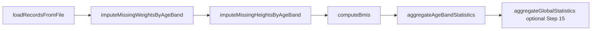
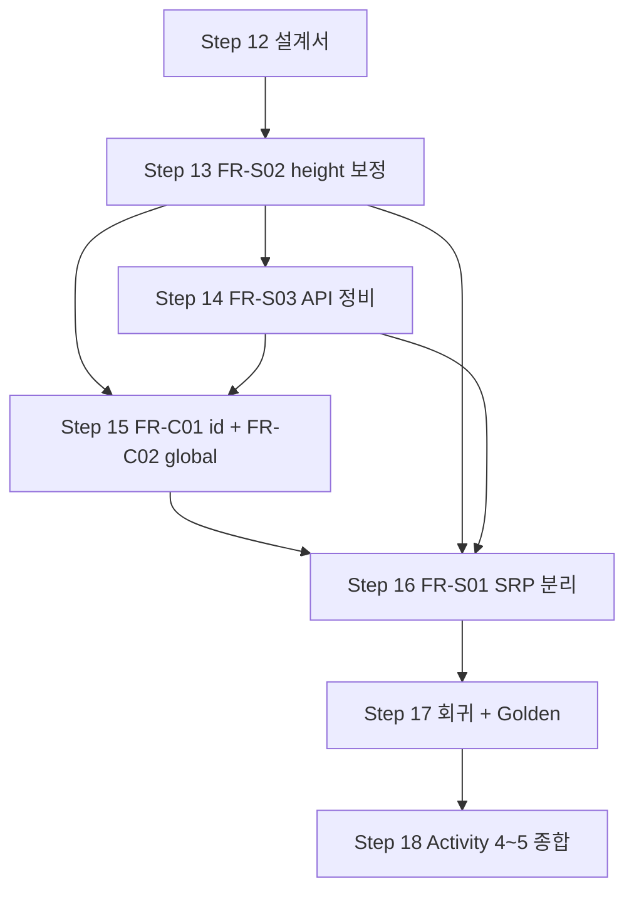

# SHealth BMI — 기능 개선 요구사항·설계서 (Feature Requirements & Design)

| 항목 | 내용 |
|------|------|
| 문서 버전 | 1.0 |
| 작성일 | 2026-05-20 |
| Step | 12 — 기능 개선 요구사항·설계 (Feature Branch Kickoff) |
| commit string (권장) | `12_기능_개선_요구사항_설계_Feature_Kickoff` |
| Persona | 시니어 비즈니스·시스템 분석가 + 소프트웨어 아키텍트 |
| 브랜치 | `feature` (선행: `tc`에서 Step 09~11 Green) |
| 입력 | `docs/requirements_analysis.md`, `docs/qa_final_report.md`, `docs/test_plan.md`, `docs/refactoring_notes.md`, `docs/golden_master.md`, Step 04~11 코드·테스트 |
| 구현 Step | 13 FR-S02 → 14 FR-S03 → 15 FR-C01/C02 → 16 FR-S01 → 17 회귀·Golden → 18 종합 |

---

## 1. 개요

### 1.1 목적

README **Activity 4(기능 개선)** 5항목을 **구현 단위**로 분해하고, `feature` 브랜치에서 Step 13~17 구현에 필요한 **입출력·전제·예외·테스트·Golden 호환 전략**을 단일 설계 기준으로 고정한다.

### 1.2 As-Is 기준선 (Step 11)

| 항목 | 상태 |
|------|------|
| Must FR-01~08 | 충족 — `ctest` 40/40 (39 unit + 1 Golden) |
| 파이프라인 | `loadRecordsFromFile` → `imputeMissingWeightsByAgeBand` → `computeBmis` → `aggregateAgeBandStatistics` |
| 공개 API | `calculateBmi`, `getBmiRatio` (+ 테스트 hook `testClassifyBmi`, `testIsInAgeBand`) |
| id 필드 | CSV 1열 **미파싱·미저장** (`loadRecordsFromFile`은 age/weight/height만 적재) |
| height=0 | **미보정** — BMI inf/NaN, 집계 시 `!isfinite` 스킵 (DEF-002 Open) |
| 연령대 분포 | `AgeBandRatios[6]` + `getBmiRatio(ageClass, type 100~400)` 로 이미 제공 (FR-05/06) |

### 1.3 설계 원칙

1. **하위 호환:** 기존 `calculateBmi` / `getBmiRatio` / FR-08 main 6행 stdout 계약은 **기본 유지**.
2. **대칭 보정:** weight=0·height=0 보정은 동일 연령대·동일 알고리즘(유효값 산술 평균)으로 **대칭** 설계.
3. **테스트 선행:** `docs/test_plan.md` §6 예약 TC ID와 1:1 매핑.
4. **Golden 분리:** FR-08 6연령대 출력만 Golden 대상; 신규 데모 출력은 **별도** 또는 스모크 TC.
5. **과도 추상화 금지:** Step 16 SRP는 Step 13~15 동작 안정 후 **최소 분리** (`.cursorrules`).

---

## 2. README Activity 4 → 구현 단위·우선순위

| README Activity 4 항목 | 요구 ID | 구현 단위 (설계명) | 우선순위 | 구현 Step | 비고 |
|------------------------|---------|-------------------|----------|-----------|------|
| Height 0 평균 보정 | **FR-S02** | `ImputeHeights` — `imputeMissingHeightsByAgeBand()` | **P0** | 13 | DEF-002; 파이프라인 핵심 |
| 특정 연령대 BMI 분포 비율 | **FR-S03** | `AgeBandDistributionApi` — 명시적 조회 API | **P0** | 14 | 비즈니스 로직은 As-Is; API 정식화 |
| BMI 정상 범위 사용자 목록 | **FR-C01** | `NormalBmiUserList` — id 파싱·저장·조회 | **P1** | 15 | Could; id 저장 선행 |
| 전체 사용자 범주 비율 | **FR-C02** | `GlobalBmiRatios` — 전체 4분류 % | **P1** | 15 | Could; 연령대 통계와 독립 |
| SRP 책임 분리 | **FR-S01** | `SrpBoundaries` — I/O·보정·BMI·집계·조회·출력 경계 | **P1** | 16 | 구조만; 동작 동일 |

> **FR-S03 해석:** README「연령대 BMI 분포 추가」는 FR-05/FR-06에 **이미 존재**. 본 스프린트 FR-S03 = `getBmiRatio` **호환 유지** + `AgeBandRatios` 기반 **명시적 API** (`requirements_analysis.md` Note).

### 2.1 P0 / P1 정의

| 등급 | 의미 | Exit |
|------|------|------|
| **P0** | Activity 4 핵심·Open 결함 연계; Golden/단위 회귀 필수 | Step 13~14 완료 시 `TC-HGT-10/11`, `AgeBandDistributionApi` Green |
| **P1** | Could·구조 개선; P0 Green 후 착수 | Step 15~16 완료 시 `TC-LST-*`, `TC-GLB-*`, Architecture 회귀 Green |

---

## 3. 처리 파이프라인 (To-Be)

### 3.1 호출 순서 (Normative)



| 순서 | 단계 | 책임 (FR-S01 경계) | 입력 | 출력 |
|------|------|-------------------|------|------|
| 1 | 로드 | **File I/O** | CSV 경로 | `recordCount`, `ages[]`, `weights[]`, `heights[]`, `ids[]` (Step 15+) |
| 2 | 체중 보정 | **Imputation (weight)** | `weights`, `ages` | `weights` 갱신 (0 → 동연령대 평균) |
| 3 | 키 보정 | **Imputation (height)** | `heights`, `ages` | `heights` 갱신 (0 → 동연령대 평균) |
| 4 | BMI | **BMI Calculation** | 보정 후 weight/height | `bmis[]` |
| 5 | 연령대 집계 | **Age-band Statistics** | `bmis`, `ages` | `ageBandRatios[6]` |
| 6 | 전체 집계 (신규) | **Global Statistics** | `bmis` (전 레코드) | `globalRatios` (Step 15) |

**순서 근거**

- weight·height 보정은 **BMI 계산 전** 모두 완료해야 함.
- weight 보정 → height 보정 순서는 **상호 독립**(평균에 서로의 0값 미포함)이므로 README 대칭성·기존 코드 변경 최소화를 위해 **기존 weight 단계 유지 후 height 추가**.
- height 보정을 weight **이전**으로 바꿔도 동일 연령대 평균 정의상 결과는 동일하나, Step 13 diff·회귀 범위를 줄이기 위해 **weight → height** 채택.

### 3.2 `calculateBmi` 오케스트레이션 (To-Be)

```cpp
int SHealth::calculateBmi(const std::string& filename) {
    if (loadRecordsFromFile(filename) == 0) return 0;
    imputeMissingWeightsByAgeBand();
    imputeMissingHeightsByAgeBand();  // FR-S02
    computeBmis();
    aggregateAgeBandStatistics();
    aggregateGlobalBmiStatistics();    // FR-C02 (Step 15)
    return recordCount;
}
```

---

## 4. 기능별 상세 설계

### 4.1 FR-S02 — height=0 동연령대 평균 키 보정 (P0)

#### 4.1.1 요구 요약

| 항목 | 내용 |
|------|------|
| 트리거 | `height == 0.0` (부동소수 **정확 비교**, weight 보정과 동일) |
| 보정값 | 동일 연령대 `[bandStart, bandStart+10)` 내 `height != 0` 레코드의 **산술 평균(cm)** |
| 비대칭 | 타 연령대 키·체중 평균 사용 **금지** |

#### 4.1.2 입력·출력

| | 설명 |
|---|------|
| **입력** | `recordCount`, `ages[]`, `heights[]` (로드·체중 보정 후) |
| **출력** | `heights[i]` in-place 갱신; 반환값 없음 (`void`) |
| **전제** | `calculateBmi`가 최소 1건 로드 성공 |

#### 4.1.3 알고리즘 (weight 보정과 대칭)

```
for bandStart in {20, 30, ..., 70}:
    validHeightCount = count(i: in band(i) and heights[i] != 0)
    if validHeightCount == 0: continue
    avgHeight = sum(heights[i] for valid) / validHeightCount
    for i in band: if heights[i] == 0: heights[i] = avgHeight
```

#### 4.1.4 예외·엣지

| ID | 시나리오 | 처리 (Normative) | TC |
|----|----------|------------------|-----|
| E-S02-01 | 동연령대 유효 키 **0건** | 보정 **스킵**; height=0 유지 → BMI non-finite | TC-HGT-11 |
| E-S02-02 | 전원 height=0 | E-S02-01과 동일 | TC-HGT-11 |
| E-S02-03 | height=0, weight>0 | 보정 성공 시 유한 BMI·정상 분류 | TC-HGT-10 |
| E-S02-04 | height=0, weight=0 | weight 보정 후 height 보정; 둘 다 유효값 없으면 각각 스킵 | TC-HGT-10 확장 |
| E-S02-05 | non-finite BMI after impute | `aggregate`에서 `!isfinite(bmis[i])` → 분류 카운트 **제외** (As-Is 유지) | TC-HGT-01/02 갱신 |
| E-S02-06 | `shealth.dat` 실데이터 | height=0 **미존재** (grep 기준) → Golden **수치 불변** 기대 | TC_GM_01 |

#### 4.1.5 구현 산출물 (Step 13)

- `void imputeMissingHeightsByAgeBand();` (private, `SHealth.cpp`)
- `docs/feature_implementation_notes.md` §13

---

### 4.2 FR-S03 — 연령대 BMI 4분류 비율 명시적 API (P0)

#### 4.2.1 목표

- `getBmiRatio(int ageClass, int type)` **하위 호환 유지** (main·Golden·기존 39 TC).
- 연령대별 4분류를 **한 번에** 조회하는 명시 API 제공.
- `BmiCategory` / legacy type 100~400 매핑을 API 계약에 **문서화**.

#### 4.2.2 API 방안 비교

| 방안 | 시그니처 (안) | 장점 | 단점 | **채택** |
|------|---------------|------|------|----------|
| A | `getBmiRatio` only | 변경 없음 | 4회 호출·type magic | 기존 유지 |
| B | `AgeBandRatios getAgeBandRatios(int ageClass) const` | 1회 조회·타입 안전 | 잘못된 ageClass 처리 필요 | **권장** |
| C | `double getAgeBandRatio(int ageClass, BmiCategory cat)` | enum 직접 | 4회 호출 가능 | 선택적 보조 |
| D | B public + `getBmiRatio`가 B 위임 | 하위 호환 + SSOT | 구현 2경로 | **권장 구현** |

#### 4.2.3 채택 API 계약 (To-Be)

```cpp
// 기존 유지
double getBmiRatio(int ageClass, int type);

// FR-S03 신규 (public)
const AgeBandRatios& getAgeBandRatios(int ageClass) const;
// 또는 값 반환: AgeBandRatios getAgeBandRatios(int ageClass) const;
```

| 메서드 | 전제 | 입력 | 출력 | 예외 |
|--------|------|------|------|------|
| `getAgeBandRatios` | `calculateBmi` 선행 권장 | `ageClass` ∈ {20,30,40,50,60,70} | 해당 `AgeBandRatios` (% 단위, 0~100) | 잘못된 ageClass → **zero ratios** (`{}`) |
| `getBmiRatio` | 동일 | `type` 100/200/300/400 | `ratioForCategory` 결과 | 잘못된 age/type → **0.0** (As-Is) |

**구현 노트:** `getBmiRatio` 내부를 `getAgeBandRatios(ageClass)` + `ratioForCategory`로 **위임**하여 SSOT 유지.

#### 4.2.4 비율 의미 (연령대)

- 분모: 해당 연령대 **전체 레코드 수** `bandMemberCount` (As-Is `aggregateAgeBandStatistics`).
- 분자: **유한 BMI**만 `classifyBmi` 카운트 (non-finite는 분자 제외, 분모에는 포함 — As-Is).
- 단일 연령대·유한 BMI만: 4분류 합 **100% ± 0.01** (`TC-CLS-08` 동일 정책).

#### 4.2.5 main / Golden

- `SHealthBMI.cpp` 6행 `printf`는 **`getBmiRatio` 또는 `getAgeBandRatios` 동일 수치** — **포맷 문자열 변경 없음** (FR-08).
- Golden baseline: FR-S03만으로는 **갱신 불필요** (로직 동일·표면 API만 추가).

---

### 4.3 FR-C01 — 정상 BMI 사용자 ID 목록 (P1)

#### 4.3.1 요구 요약

| 항목 | 내용 |
|------|------|
| 정상 BMI | README: **18.5 초과, 23 미만** ↔ `classifyBmi` → `BmiCategory::Normal` (`18.5 < BMI < 23`) |
| 반환 | 정상 분류된 사용자 **ID 목록** (오름차순 권장, 중복 없음) |

#### 4.3.2 데이터 모델 변경

| 필드 | 타입 | 비고 |
|------|------|------|
| `ids[]` | `int[MAX_RECORDS]` 또는 `std::vector<int>` (Step 16) | CSV `tokens[0]` → `std::stoi` |

**id 파싱 예외 (E-C01-03)**

| 시나리오 | 처리 |
|----------|------|
| id 비숫자 | 해당 행 **스킵** + stderr (Step 10 CSV 정책과 동일) |
| id 빈 토큰 | 스킵 |
| `stoi` overflow | 스킵 + 로그 |

#### 4.3.3 API (안)

```cpp
std::vector<int> getNormalBmiUserIds() const;
```

| | 설명 |
|---|------|
| **입력** | (없음 — 내부 `bmis[]`, `ids[]` 사용) |
| **출력** | 정상 분류 id 목록; `calculateBmi` 미호출 시 **빈 vector** |
| **전제** | 보정·BMI·집계 파이프라인 완료 후 호출 |
| **경계** | BMI=18.5, 23.0 → **포함 안 함** (저체중/과체중) |
| **non-finite BMI** | 목록 **제외** |

#### 4.3.4 main 출력 (데모, Golden 비대상)

```
Normal BMI users (count=N): id1, id2, ...
```

- 한 줄 요약 또는 다행 출력 — Step 15에서 `feature_implementation_notes.md`에 최종 포맷 고정.
- **Golden Master 대상 아님** (FR-08 6행만 유지).

---

### 4.4 FR-C02 — 전체 사용자 4분류 비율 (P1)

#### 4.4.1 요구 요약

| 항목 | 내용 |
|------|------|
| 범위 | **모든 로드된 레코드** (연령 19·80+ 포함) |
| 지표 | 4분류 **인원 비율(%)** — 연령대별 `getBmiRatio`와 **독립** |
| API (안) | `AgeBandRatios getGlobalBmiRatios() const;` 또는 `GlobalBmiRatios` typedef 동일 구조체 |

#### 4.4.2 집계 규칙

| 항목 | 규칙 |
|------|------|
| 분모 | `recordCount` (로드 성공 건수) |
| 분자 | `isfinite(bmis[i])` 인 레코드만 `classifyBmi` 카운트 |
| non-finite | 분자 제외; **분모에는 포함** (연령대 집계와 동일 정책) |
| 빈 데이터 | 4분류 0% |

**검증:** 유한 BMI만 있는 fixture에서 4분류 합 ≈ 100% (`TC-GLB-01`). 연령대 밖(age=19)만 있는 fixture로 연령대 API 0% vs 전체 API >0% (`TC-GLB-02`).

#### 4.4.3 main 출력 (데모, Golden 비대상)

```
Global - underweight = %f, normal = %f, overweight = %f, obesity = %f
```

---

### 4.5 FR-S01 — SRP 책임 분리 (P1, Step 16)

Step 04 이후 구조를 기준으로 **역할 경계**만 정의한다 (구현은 Step 16).

| 경계 | 책임 | As-Is (Step 11) | To-Be (목표) |
|------|------|-----------------|--------------|
| **File I/O** | CSV 읽기·토큰화·행 스킵 | `loadRecordsFromFile`, `split` | `CsvRecordLoader` 또는 동등 free 함수 |
| **Imputation** | weight/height 0 보정 | `imputeMissingWeightsByAgeBand`, (신규) height | `AgeBandImputer` |
| **BMI** | cm→m, BMI 배열 | `computeBmis`, `classifyBmi` | `BmiCalculator` |
| **Statistics** | 연령대·전체 집계 | `aggregateAgeBandStatistics`, (신규) global | `BmiStatisticsAggregator` |
| **Query API** | 비율·목록 조회 | `getBmiRatio`, (신규) FR-S03/C01/C02 | `SHealth` **Facade** 또는 동일 클래스 public |
| **Presentation** | stdout | `SHealthBMI.cpp` `printf` | Presenter만; 도메인 로직 없음 |

**제약**

- public API 시그니처 **변경 없음** (Step 16).
- `Architecture` 스위트: Step 06 fixture로 **동일 입출력** 회귀 (`docs/test_plan.md` §6.1 FR-S01).

---

## 5. BMI·분류 SSOT (공통)

모든 신규 기능은 `classifyBmi` 및 README 경계를 **단일 기준**으로 사용한다 (Step 04 P0 반영 완료).

| BMI | 분류 | FR-C01 포함 |
|-----|------|-------------|
| ≤ 18.5 | 저체중 | 아니오 |
| 18.5 < BMI < 23 | 정상 | **예** |
| 23 ≤ BMI < 25 | 과체중 | 아니오 |
| ≥ 25 | 비만 | 아니오 |

---

## 6. 테스트 계획 매핑 (`docs/test_plan.md` §6)

### 6.1 Should — FR-S01~S03

| 요구 ID | 예약 스위트 | TC ID | 설계 검증 포인트 | Step |
|---------|-------------|-------|------------------|------|
| FR-S01 | `Architecture` | (기존 TC 전체 재실행) | API·수치·건수 동일 | 16 |
| FR-S02 | `HeightImputation` | **TC-HGT-10** | 30대: h=170,175,0 → 0→172.5; 유한 BMI·분류 | 13 |
| FR-S02 | `HeightImputation` | **TC-HGT-11** | 40대 전원 h=0 → 스킵, non-finite 집계 제외 | 13 |
| FR-S03 | `AgeBandDistributionApi` | **TC-API-01** | `getAgeBandRatios(20)` == 4× `getBmiRatio(20, type)` | 14 |
| FR-S03 | `AgeBandDistributionApi` | **TC-API-02** | 6연령대 × 4분류 매트릭스 스냅샷 | 14 |
| FR-S03 | `AgeBandDistributionApi` | **TC-API-03** | 잘못된 ageClass → zero ratios / getBmiRatio 0.0 | 14 |
| FR-S03 | `AgeBandDistributionApi` | **TC-API-04** | 단일 연령대 4명 각 1분류 → 합 100% ±0.01 | 14 |

> §6 원문의 TC-HGT-10/11·`AgeBandDistributionApi` 명칭 유지. TC-API-* 는 Step 14 구현 시 `SHealthBMITest.cpp`에 추가.

### 6.2 Could — FR-C01~C02

| 요구 ID | 예약 스위트 | TC ID | 설계 검증 포인트 | Step |
|---------|-------------|-------|------------------|------|
| FR-C01 | `NormalBmiUsers` | **TC-LST-01** | 3명: 저체중·정상·비만 → 정상 id만 | 15 |
| FR-C01 | `NormalBmiUsers` | **TC-LST-02** | BMI=18.5, 23.0 경계 id **제외** | 15 |
| FR-C01 | `NormalBmiUsers` | **TC-LST-03** | `calculateBmi` 미호출 → 빈 목록 | 15 |
| FR-C02 | `GlobalBmiRatios` | **TC-GLB-01** | 4분류 합 ≈ 100% (유한 BMI fixture) | 15 |
| FR-C02 | `GlobalBmiRatios` | **TC-GLB-02** | age=19만: `getBmiRatio(20,*)==0`, global normal>0 | 15 |

### 6.3 As-Is height TC (갱신 대상)

| TC ID | Step 12 As-Is | Step 13+ 기대 |
|-------|---------------|---------------|
| TC-HGT-01 | height=0 → non-finite, 집계 스킵 | TC-HGT-10 시나리오로 **대체·갱신** |
| TC-HGT-02 | w=0,h=0 → NaN | 보정 규칙 반영 후 재정의 |

### 6.4 Golden·통합

| TC | 유형 | Step 17 |
|----|------|---------|
| `SHealthGoldenMaster.TC_GM_01_*` | FR-08 6행 | shealth.dat에 height=0 없으면 **baseline 불변**; FR-S02만으로 drift 없음 확인 |
| 신규 main 데모 출력 | 스모크(optional) | Golden **비포함** |

---

## 7. Golden Master·FR-08 호환 전략

### 7.1 유지 vs 확장

| 출력 | FR | Golden 대상 | 전략 |
|------|-----|-------------|------|
| 6연령대 × 4분류 `printf` | FR-08 | **예** | 포맷·순서·`%f` 6자리 **고정**; `getBmiRatio`/`getAgeBandRatios` 동일 값 |
| 정상 ID 목록 | FR-C01 | **아니오** | 별도 스모크 또는 수동 확인 |
| 전체 4분류 | FR-C02 | **아니오** | 동일 |
| stderr | — | 아니오 | — |

### 7.2 Baseline 갱신 조건

| 조건 | Golden 갱신 | 절차 |
|------|-------------|------|
| FR-S02 구현 + `shealth.dat`에 height=0 **없음** | **불필요** (수치 동일 기대) | Step 17에서 `TC_GM_01` 확인만 |
| FR-S02가 실데이터 BMI 분포 변경 | **필요** | `tests/golden/update_baseline.ps1`, 커밋 메시지에 DEF-002·FR-S02 명시 |
| BMI 경계·분류 로직 변경 | **필요** | Step 04에서 이미 반영됨 |
| main 6행 **문자열** 변경 | **필요** | 파서·golden 동시 수정 |
| FR-S03/C01/C02 API만 추가, main 6행 동일 | **불필요** | — |
| FR-C01/C02 데모 `printf` **추가** (6행 뒤) | **정책 선택** | **권장: Golden 비포함** — `SHealthGoldenTest`는 6행만 파싱; 추가 줄은 테스트 바이너리 분리 또는 필터 |

### 7.3 Step 17 회귀 게이트

```powershell
cd build-gcc
cmake --build .
ctest --output-on-failure
ctest -R SHealthGoldenMaster -V
```

- 단위: Step 13~15 신규 TC 포함 **전체 Green**.
- Golden: 의도적 drift 없으면 `shealth_bmi_stdout.golden.txt` **diff 0**.

---

## 8. Step 13~17 구현 순서·의존 관계



| Step | ID | 의존 | 산출물 | 블로커 |
|------|-----|------|--------|--------|
| **12** | 설계 | Step 11 Green | 본 문서 | — |
| **13** | FR-S02 | 12 | 코드, `TC-HGT-10/11`, impl notes §13 | — |
| **14** | FR-S03 | 12, 13 권장 | `getAgeBandRatios`, `AgeBandDistributionApi` | 13 Green |
| **15** | FR-C01/C02 | 12, 13, 14 | id 저장, global 집계, `TC-LST-*`, `TC-GLB-*` | id 파싱 |
| **16** | FR-S01 | 13~15 | `feature_srp_refactoring.md`, Architecture 회귀 | 동작 동결 |
| **17** | 회귀 | 13~16 | `feature_regression_report.md`, Golden | ctest 실패 |
| **18** | 종합 | 12~17 | `feature_final_report.md`, qa 갱신 | — |

**병렬 불가:** 15는 13(보정·BMI) 완료 후; 16은 15 API 동결 후.

---

## 9. 추적성 매트릭스

| README Activity 4 | 요구 ID | 설계 § | 구현 Step | TC |
|-------------------|---------|--------|-----------|-----|
| Height 0 보정 | FR-S02 | §4.1, §3 | 13 | TC-HGT-10/11 |
| 연령대 BMI 분포 | FR-S03 | §4.2 | 14 | AgeBandDistributionApi |
| 정상 BMI 목록 | FR-C01 | §4.3 | 15 | TC-LST-* |
| 전체 범주 비율 | FR-C02 | §4.4 | 15 | TC-GLB-* |
| SRP 분리 | FR-S01 | §4.5 | 16 | Architecture |
| (Must 유지) main 6행 | FR-08 | §7 | 14~17 | TC_GM_01 |

| 이슈 | 설계 반영 |
|------|-----------|
| I-03 height=0 | §4.1 FR-S02 |
| I-11 id 미사용 | §4.3 id 파싱 |
| I-02 동연령대 유효값 0건 | §4.1 E-S02-01, weight와 동일 스킵 |
| DEF-002 | §4.1 P0, Step 13 |

---

## 10. 리스크·결정 사항

| ID | 리스크 | 완화 |
|----|--------|------|
| R-01 | id `int` overflow | `stol` 검사 또는 스킵; TC-LST에 대형 id optional |
| R-02 | 4분류 합 ≠ 100% (non-finite 분모 포함) | As-Is 정책 유지·문서화; TC-GLB-01은 유한 BMI fixture |
| R-03 | main 데모 출력이 Golden 파서 깨뜨림 | 6행만 비교·추가 출력은 Golden 비대상 |
| R-04 | SRP 과분리 | Step 16에서 클래스 2~3개 상한, Facade 유지 |

**결정 로그 (Step 12)**

| 결정 | 선택 | 근거 |
|------|------|------|
| FR-S03 | `getAgeBandRatios` + `getBmiRatio` 위임 | 하위 호환 + 명시 API |
| 보정 순서 | weight → height → BMI | 기존 diff 최소·대칭 |
| Golden | FR-08만 | qa_final_report·golden_master 일관 |
| FR-C01 id 타입 | `int` (As-Is CSV 정수) | `stoi` 일관; string id는 Won't |

---

## 11. 변경 이력

| 버전 | 일자 | 변경 |
|------|------|------|
| 1.0 | 2026-05-20 | Step 12 — 기능 개선 요구·설계 초안 (`feature` kickoff) |

**다음 Step 입력:** 본 문서 → Step 13 `docs/feature_implementation_notes.md` (§13 FR-S02 구현)
