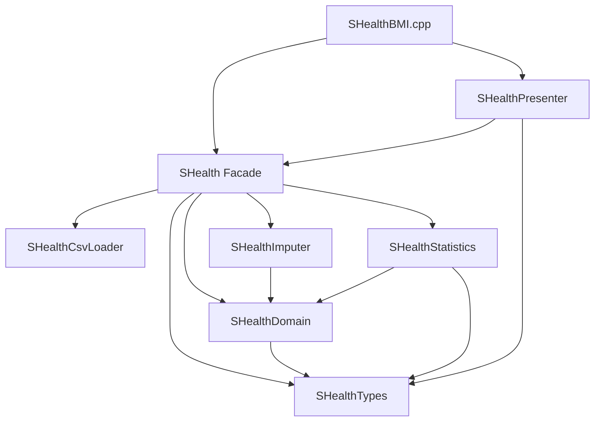

# SHealth BMI — FR-S01 SRP 책임 분리 (Step 16)

| 항목 | 내용 |
|------|------|
| 문서 버전 | 1.0 |
| 작성일 | 2026-05-20 |
| Step | 16 — SRP 책임 분리 (FR-S01) |
| 설계 기준 | `docs/feature_requirements_design.md` §4.5 |
| commit string (권장) | `16_SRP_책임_분리_FR-S01` |

---

## 1. 목표

Step 04(함수 추출)·Step 13~15(기능 추가) 이후 **모노리식 `SHealth`** 를 설계서 SRP 경계에 맞게 **파일·네임스페이스 단위로 분리**한다. public API·동작·Golden 6행은 **하위 호환** 유지.

---

## 2. 분리 전·후 책임 매트릭스

| 경계 (FR-S01) | Before (Step 15) | After (Step 16) | 산출물 |
|---------------|------------------|-----------------|--------|
| **공유 타입** | `SHealth.h` 내 enum/struct | `SHealthTypes.h` | `BmiCategory`, `AgeBandRatios` |
| **File I/O** | `SHealth::loadRecordsFromFile`, `split` | `SHealthCsvLoader` | `SHealthCsvLoader.cpp` |
| **Imputation (weight/height)** | `SHealth::imputeMissing*` | `SHealthImputer` | `SHealthImputer.cpp` |
| **BMI 계산·분류** | `computeBmis`, `classifyBmi`, 연령대 헬퍼 | `SHealthDomain` | `SHealthDomain.cpp` |
| **Statistics (연령대·전체)** | `aggregateAgeBand*`, `aggregateGlobal*` | `SHealthStatistics` | `SHealthStatistics.cpp` |
| **Query API (Facade)** | `SHealth` public 메서드 | `SHealth` (오케스트레이션·캐시만) | `SHealth.cpp` |
| **Presentation** | `SHealthBMI.cpp` 내 `printf` | `SHealthPresenter` | `SHealthPresenter.cpp` |
| **main** | 로드+출력 혼재 | `calculateBmi` 호출 + Presenter 위임 | `SHealthBMI.cpp` |

### 2.1 `SHealth` Facade 잔여 책임

| 책임 | 설명 |
|------|------|
| 레코드 저장소 | `ids/ages/weights/heights/bmis[MAX_RECORDS]` |
| 파이프라인 오케스트레이션 | `calculateBmi` — 모듈 호출 순서 고정 |
| 집계 결과 캐시 | `ageBandRatios[]`, `globalBmiRatios`, `normalBmiUserIds_`, `statisticsReady` |
| public 조회 API | `getBmiRatio`, `getAgeBandRatios`, `getNormalBmiUserIds`, `getGlobalBmiRatios` |
| 테스트 hook | `testClassifyBmi`, `testIsInAgeBand` → `SHealthDomain` 위임 |

---

## 3. 모듈 의존 관계

**파이프라인 순서 (불변):**

`loadRecordsFromFile` → `imputeMissingWeightsByAgeBand` → `imputeMissingHeightsByAgeBand` → `computeBmis` → `aggregateAgeBandStatistics` → `aggregateGlobalBmiStatistics`

---

## 4. public API·하위 호환

| API | 변경 |
|-----|------|
| `int calculateBmi(const std::string& filename)` | **없음** |
| `double getBmiRatio(int ageClass, int type)` | **없음** |
| `const AgeBandRatios& getAgeBandRatios(int ageClass) const` | **없음** |
| `std::vector<int> getNormalBmiUserIds() const` | **없음** |
| `const AgeBandRatios& getGlobalBmiRatios() const` | **없음** |
| `testClassifyBmi` / `testIsInAgeBand` | **없음** (구현만 Domain 위임) |

**Breaking change:** 없음. `docs/feature_implementation_notes.md` §16에 동일 기록.

---

## 5. CMake / 파일 목록

`shealth_lib` 소스:

| 파일 | 역할 |
|------|------|
| `SHealthTypes.h` | 공유 타입 (헤더 only) |
| `SHealthDomain.h/.cpp` | BMI·분류·연령대 유틸 |
| `SHealthCsvLoader.h/.cpp` | CSV 로드 |
| `SHealthImputer.h/.cpp` | weight/height 0 보정 |
| `SHealthStatistics.h/.cpp` | 연령대·전체 집계 |
| `SHealthPresenter.h/.cpp` | stdout |
| `SHealth.h/.cpp` | Facade |

테스트 `include` 변경: **불필요** (`SHealth.h` 경유).

---

## 6. 회귀 검증 (Architecture)

`docs/test_plan.md` §6.1 FR-S01: 기존 TC 전체 재실행.

| 결과 | 내용 |
|------|------|
| 단위 | **51/51** Passed (`SHealthBMITest`) |
| Golden | **1/1** Passed — FR-08 6연령대 stdout baseline diff 0 |
| 합계 | **52/52** Green (`build-gcc`, 2026-05-20) |

---

## 7. 남은 기술 부채

| 우선순위 | 항목 | 비고 |
|----------|------|------|
| P2 | `std::vector<HealthRecord>` 전환 | `MAX_RECORDS` 고정 배열·Facade 저장소 |
| P2 | CSV / `istream` 주입 (DIP) | `SHealthCsvLoader` 파일 경로 하드 결합 |
| P3 | CLI 데이터 경로 인자 | `SHealthBMI` `shealth.dat` 고정 |
| P3 | `getBmiRatio` 잘못된 인자 vs 0% 구분 | optional |
| — | Presenter를 인터페이스로 추상화 | 과도 추상화 금지 — 현재 free 함수 네임스페이스로 충분 |
| — | 클래스 2~3개 상한 (설계 R-04) | **6 네임스페이스 + Facade** — 파일 분리이나 OOP 클래스는 Facade 1개만 |

---

## 8. 변경 이력

| 버전 | 일자 | 변경 |
|------|------|------|
| 1.0 | 2026-05-20 | Step 16 FR-S01 초안 |
