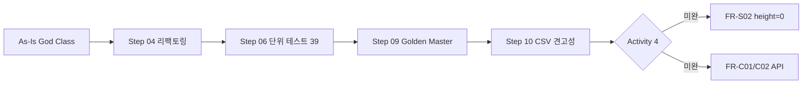

# SHealth BMI — QA 종합 최종 보고서 (Final QA Report)

| 항목 | 내용 |
|------|------|
| 문서 버전 | 1.0 |
| 작성일 | 2026-05-20 |
| Step | 11 — QA 종합 검토 (최종 보고서) |
| commit string (권장) | `11_QA_종합_검토_Final_Report` |
| Persona | QA·기술 리드 (발표·회고) |
| 입력 | Steps 01~10 산출물, `README.md` Activities 1~5 |
| 검증 시점 | `build-gcc` — **ctest 40/40 Passed** (2026-05-20) |

---

## 1. Executive Summary

6시간 생성형 AI 실습(SHealth BMI)에서 **Activities 1~3·5(분석·1차 리팩토링·단위 테스트·회귀 안전장치)** 는 목표 대비 **달성**하였고, **Activity 4(기능 개선 2시간)** 는 README Should/Could 항목 중 **일부만** 반영된 상태이다.

| 영역 | 결과 | 근거 |
|------|------|------|
| Must 요구 (FR-01~08) | **달성** | 단위 39건 + Golden 1건 Green; BMI=25 수정·출력 계약 유지 |
| Should (FR-S01~S04) | **부분 달성** | S04 테스트·S03 API 정비(부분)·S01 함수 추출; **S02 height=0 미구현** |
| Could (FR-C01~C02) | **미착수** | 정상 BMI ID 목록·전체 범주 비율 API 없음 |
| 품질·회귀 | **양호** | P0 결함 수정, Golden Master, `ctest` 자동화 |
| 잔여 | **2 Open** | DEF-002 (FR-S02), DEF-011 (CWD) |

**발표 핵심 메시지:** 의도적 안티패턴 코드를 **요구·테스트·Golden** 삼각형으로 고정한 뒤 리팩토링했으며, 다음 스프린트는 **Activity 4 잔여(특히 height 보정·SRP)** 에 집중하는 것이 ROI가 가장 높다.

---

## 2. 실습 목표 대비 달성도 (README Activities)

| Activity | 목표 | 달성도 | 증거 |
|----------|------|--------|------|
| **1** 문제 분석·코드 스멜 | 구조·BMI·스멜 이해 | **100%** | `docs/code_quality_analysis.md`, `docs/requirements_analysis.md` |
| **2** 1차 리팩토링 | 네이밍·상수·추출·중복 제거 | **100%** | `docs/refactoring_notes.md`, Step 04 코드 |
| **3** Unit Test | BMI·보정·분류·예외 TC | **100%** | `docs/test_cases.md` — 39건 Green |
| **4** 기능 개선 | SRP·height 보정·신규 API | **~25%** | 아래 §5 로드맵 |
| **5** 회고·발표 | Before/After·AI·TC·클린코드 | **본 문서** | §3~§7 |



---

## 3. 요구사항 대비 달성도

### 3.1 기능 요구 (MoSCoW)

| 우선순위 | ID | 요구사항 | 상태 | 검증 |
|----------|-----|----------|------|------|
| **Must** | FR-01~08 | CSV·BMI·보정·4분류·연령대·API·main 출력 | **충족** | TC-BMI/IMP/CLS/AGE/RAT/EXC, `TC_GM_01` |
| **Should** | FR-S01 | SRP 책임 분리 | **부분** | private 파이프라인 4~5함수; 클래스 분리는 미완 |
| **Should** | FR-S02 | height=0 동연령대 보정 | **미충족** | DEF-002 Open, `TC_HGT_*` As-Is |
| **Should** | FR-S03 | 연령대 분포 API 정비 | **부분** | `AgeBandRatios[6]`, `getBmiRatio` 테이블화 |
| **Should** | FR-S04 | 단위 테스트·ctest Green | **충족** | 39 unit tests |
| **Could** | FR-C01 | 정상 BMI 사용자 ID 목록 | **미착수** | id 미파싱·미저장 |
| **Could** | FR-C02 | 전체 사용자 4분류 비율 | **미착수** | — |
| **Won't** | — | 10대·80+ 별도 리포트 | **유지** | 20~70대만 집계 (요구 동일) |

### 3.2 비기능 요구

| ID | 요구 | 상태 |
|----|------|------|
| NFR-01~02 | CMake·C++17·GTest·ctest | 충족 |
| NFR-03 | 코드 스멜 제거(1~2차) | 1차 충족, SRP·DIP는 Activity 4 잔여 |
| NFR-05 | 회귀 (Golden) | **충족** — `docs/golden_master.md`, DEF-006 Fixed |
| NFR-06 | docs/Report/Prompting 산출 | Steps 01~11 문서화 |

### 3.3 README BMI 경계 (I-01) — 해소

Step 04에서 **BMI = 25.0 → 비만** 수정. `TC_CLS_06`, `TC_BMI_02` 및 Golden baseline(Step 04 반영분)으로 고정. (`docs/defect_list.md` §3, DEF-007 **Fixed**)

---

## 4. 테스트·결함·Golden Master 요약

### 4.1 테스트 자산

| 구분 | 수량 | Exit 기준 | 현재 |
|------|------|-----------|------|
| 단위 테스트 (`SHealthBMITest`) | **39** | P0 TC 100% | **39/39 Pass** |
| Golden Master (`SHealthGoldenTest`) | **1** | 6행 stdout ±0.0001 | **1/1 Pass** |
| **합계 ctest** | **40** | Green | **40/40 Pass** (~0.85 s) |

**README Activity 3 매핑**

| Activity 3 항목 | TC 수 | 대표 스위트 |
|-----------------|-------|-------------|
| BMI 계산 | 3 | `TC_BMI_01~03` |
| Age 평균 보정 | 5 | `TC_IMP_01~05` |
| 4분류 | 8 | `TC_CLS_01~08`, `testClassifyBmi` |
| 예외 | 13+ | `TC_EXC_01~11`, `TC_RAT_02~04` |

**인프라:** `SHealthBMITestFixture` + temp CSV; 경계는 `testClassifyBmi` / `testIsInAgeBand` hook; check-in fixture `minimal_valid.dat`.

### 4.2 결함 관리 스냅샷

(`docs/defect_list.md` v1.1, `docs/defect_management.md`)

| 상태 | 건수 | ID |
|------|------|-----|
| **Fixed** | 5 | DEF-001, 003, 005, 006, 007 |
| **Open** | 2 | DEF-002 (FR-S02), DEF-011 (CWD) |
| **Won't fix** | 4 | DEF-004, 008, 009, 010 |

**Step 10 주요 조치:** CSV 컬럼 부족·비숫자 필드 graceful 스킵, `MAX_RECORDS` 방어, `TC_EXC_11` 추가. Golden baseline **불변**(정상 `shealth.dat` 행만 영향).

### 4.3 Golden Master

| 항목 | 내용 |
|------|------|
| Baseline | `tests/golden/shealth_bmi_stdout.golden.txt` (6연령대) |
| TC | `SHealthGoldenMaster.TC_GM_01_*` |
| 갱신 | `tests/golden/update_baseline.ps1` (의도적 변경 시만) |
| CWD | 테스트는 **저장소 루트**에서 `SHealthBMI` 실행 |

**역할 분리:** 단위 테스트 = API·도메인 규칙; Golden = **E2E stdout 계약**(포맷·`%f` 6자리·6연령대 순서).

---

## 5. 코드 품질 Before / After

### 5.1 정량 지표 (`docs/code_quality_analysis.md` §11 vs `docs/refactoring_notes.md` §5)

| 지표 | Before (As-Is) | After (Step 04~10) |
|------|----------------|---------------------|
| `calculateBmi` LOC | ~103 (모노리식) | **~8** (오케스트레이션) |
| `getBmiRatio` 분기 | 24 `else if` | **index + category switch** |
| 통계 저장 | 24 `double` 멤버 | **`AgeBandRatios[6]`** |
| BMI 분류 정의처 | 집계 루프 내 if | **`classifyBmi()` SSOT** |
| Magic number (도메인) | 10+ | **named `constexpr`** |
| 단위 테스트 | 1× `FAIL()` | **39 Green** |
| E2E 회귀 | 수동 stdout | **Golden + ctest** |
| CSV 견고성 | abort/예외 전파 | **행 스킵 + 로그** (Step 10) |

### 5.2 정성 진단 (Step 03 → Step 04 이후)

| SOLID / 스멜 | Before | After | 잔여 |
|--------------|--------|-------|------|
| **SRP** | God Class, Long Method | 파이프라인 함수 분리 | 파일 I/O·도메인 **클래스 분리** 미완 |
| **OCP** | 연령대·type마다 분기·멤버 증가 | `AgeBandRatios` 배열화 | 80대 확장 시 main·집계 동시 수정 가능 |
| **DIP** | `ifstream` 직접 결합 | 동일 | `istream` / Record 주입 (Activity 4) |
| Duplicate | 연령대 루프 3회, main printf 6회 | `isInAgeBand`, main 루프 | Presenter 분리 미완 |
| Correctness | BMI=25 버그, NaN 전파 | **P0 수정·가드** | height=0 (DEF-002) |

### 5.3 클린코드 체감 (회고용)

**장점**

- **단일 진실 공급원:** `classifyBmi`, 상수, `AgeBandRatios`로 경계·통계 변경 지점이 줄어듦.
- **테스트 가능성:** 리팩토링 직후 hook·fixture로 P0 경계를 빠르게 고정.
- **회귀 자신감:** Golden이 main 출력 계약을 CI(ctest) 수준으로 잠금.

**어려운 점**

- **요구 모호성:** 4분류 합=100% (I-10), weight 전원 0 (I-02) 등은 코드 수정 전 **TC로 As-Is를 문서화**해야 논쟁이 줄어듦.
- **리팩토링 vs 기능:** Activity 4를 건너뛰고 테스트만 늘리면 Open 결함(DEF-002)이 “영구 As-Is”가 될 위험.
- **Golden vs 단위:** 수치 변경(예: height 보정) 시 baseline 갱신·단위 TC를 **한 커밋**으로 묶어야 함.

---

## 6. AI 활용 효과·한계

### 6.1 도움이 된 순간

| 단계 | AI 활용 | 효과 |
|------|---------|------|
| 02 요구 분석 | README·코드 교차, MoSCoW·이슈 I-01~I-12 | BMI=25·height=0 갭을 **조기에 티켓화** |
| 03 품질 분석 | SOLID·스멜 매핑, P0/P1 우선순위 | Step 04 작업 목록이 명확해짐 |
| 04 리팩토링 | 함수 추출·상수화 제안 | ~103줄 → 오케스트레이션 구조를 단기간에 정리 |
| 05~06 테스트 | `test_plan` → 38~39 TC 구현·fixture 패턴 | Activity 3 네 가지 범주를 빠짐없이 커버 |
| 07~10 결함 | defect 티켓·회귀 체크리스트·Golden 절차 | Open/Fixed/Won't fix **추적성** 유지 |
| 11 종합 | 다문서 인용·발표용 요약 | 본 보고서 초안·일관된 용어 |

### 6.2 한계·주의점

| 한계 | 대응 |
|------|------|
| **요구 해석** | “연령대 분포 추가” = 이미 FR-05 존재 → FR-S03은 API 정비로 재정의 필요 (사람 검토) |
| **범위 크립** | Activity 4 전체를 한 Step에 넣으면 테스트·Golden이 깨짐 → 스프린트 분할 |
| **As-Is 동작** | 빈 줄 `break`, 합<100% 등은 **먼저 TC로 고정** 후 수정 여부 결정 |
| **환경 의존** | MinGW·CWD·경로 — README·ctest 전제를 문서에 명시 (DEF-011) |
| **과도 추상화** | Step 04에서 클래스 다분화 억제 → 실습 시간 대비 **함수 추출이 적절**했음 |

### 6.3 TC 작성·유지보수 팁 (Activity 3·5)

1. **경계는 직접, 통합은 fixture:** `classifyBmi` / `isInAgeBand` hook + mini CSV `calculateBmi` 조합.
2. **절대 경로 fixture:** `writeTempCsv` + temp dir로 CWD 이슈(I-12) 완화.
3. **As-Is 먼저, 수정 나중:** `TC_HGT_*`, `TC_EXC_07`처럼 스펙 갭을 Green으로 **문서화**한 뒤 DEF 티켓과 연결.
4. **한 요구 = 한 TC ID:** `TC-CLS-06`(BMI=25) ↔ DEF-007 ↔ FR-04 추적성.
5. **예외 TC는 구현과 동기화:** Step 10에서 `EXPECT_DEATH` → `EXPECT_EQ(0)` 갱신 — 코드 변경 시 TC를 **즉시** 맞출 것.
6. **Golden은 소수·안정:** 전체 데이터 스냅샷 1건 + 단위로 도메인; baseline 갱신은 스크립트·커밋 메시지에 사유 필수.
7. **회귀 체크리스트:** Activity 4 착수 전 `docs/defect_management.md` §3 R-01~R-12 실행.

---

## 7. 미완 Activity 4 — 기능 로드맵

### 7.1 백로그 (우선순위)

| 순서 | 항목 | 요구 | 예상 산출 | 회귀 |
|------|------|------|-----------|------|
| **1** | height=0 보정 | FR-S02, DEF-002 | `imputeMissingHeightsByAgeBand()`, `TC_HGT_*` 갱신 | Golden **재캡처** |
| **2** | SRP 클래스 분리 | FR-S01 | `CsvReader`, `BmiPipeline`, Presenter | 기존 40 TC Green 유지 |
| **3** | id 파싱·정상 목록 | FR-C01 | `getNormalBmiUserIds()` | `TC-LST-*` 신규 |
| **4** | 전체 4분류 비율 | FR-C02 | `getGlobalBmiRatios()` | `TC-GLB-*` |
| **5** | CLI 데이터 경로 | DEF-011 | `argc`/`argv` 또는 env | main Golden CWD 완화 |
| **6** | `vector<HealthRecord>` | I-06 장기 | `MAX_RECORDS` 제거 | TC-EXC-20 (선택) |

### 7.2 권장 다음 스프린트 (1~2일 가정)

**Sprint A — Activity 4 핵심 (Must for 실습 완결)**

- [ ] FR-S02 구현 + DEF-002 **Fixed**
- [ ] `ctest` 40/40 → height TC 기대값 변경 후 **Golden baseline** 갱신
- [ ] `docs/defect_list.md` DEF-002 상태 갱신

**Sprint B — 구조·Could (시간 여유 시)**

- [ ] FR-S01 최소 분리 (I/O vs 통계)
- [ ] FR-C01/C02 API + TC 4~6건
- [ ] DEF-011: README 실행 절 + optional CLI

**매 스프린트 공통 게이트**

```powershell
cd build-gcc
cmake --build .
ctest --output-on-failure
ctest -R SHealthGoldenMaster -V
```

---

## 8. 추적성·문서 인덱스

| Step | 산출물 |
|------|--------|
| 02 | `docs/requirements_analysis.md` |
| 03 | `docs/code_quality_analysis.md` |
| 04 | `docs/refactoring_notes.md` |
| 05~06 | `docs/test_plan.md`, `docs/test_cases.md` |
| 07~08 | `docs/defect_detection.md`, `docs/defect_list.md` |
| 09 | `docs/golden_master.md` |
| 10 | `docs/defect_management.md` |
| 11 | **본 문서** |

---

## 9. 결론 및 발표 체크리스트

| 질문 (Activity 5) | 한 줄 답 |
|-------------------|----------|
| 목표 달성도? | 분석·리팩토링·테스트·회귀 **달성**; Activity 4 **약 25%** |
| Before/After? | God Class·24분기 → 파이프라인·SSOT·40 tests (§5) |
| AI 활용? | 문서·TC·결함 추적 **가속**; 요구·범위는 **사람 검증** (§6) |
| TC 영향? | P0 경계·Open 결함을 TC/Golden에 **고정** 후 수정 (§6.3) |
| 클린코드 체감? | SSOT·테스트·Golden 삼각형이 **안전망** (§5.3) |

**권장 커밋 메시지:** `11_QA_종합_검토_Final_Report`

---

## 10. 변경 이력

| 버전 | 일자 | 변경 |
|------|------|------|
| 1.0 | 2026-05-20 | Step 11 QA 종합 최종 보고서 초안 |
| 1.1 | 2026-05-20 | 부록 B — Step 18 Activity 4~5 통합 요약 (본문 §1~9 유지) |

---

## 부록 B — Step 18: Activity 4~5 통합 요약 (v1.1)

> **목적:** Step 11 본문(Activities 1~3·5 초안, Activity 4 **미완** 스냅샷)은 **훼손하지 않고**, Step 12~18 기능 스프린트 **실제 달성**과 Activity 5 회고 갱신만 추가한다. 상세는 `docs/feature_final_report.md`.

### B.1 Executive Summary (Step 18 시점)

| 영역 | Step 11 (§1) | Step 18 |
|------|--------------|---------|
| Must FR-01~08 | 달성 | **유지** |
| Should FR-S01~S03 | 부분 (S02·S01 미완) | **S01~S03 달성** |
| Should FR-S04 | 충족 | **유지** (51 unit) |
| Could FR-C01~C02 | 미착수 | **달성** |
| ctest | 40/40 | **52/52** |
| Activity 4 | ~25% | **~95%** |
| Open 결함 (기능) | DEF-002, DEF-011 | **DEF-011만** (002는 Step 13 구현·`TC_HGT_*` Green) |

### B.2 §7 로드맵 달성 결과 (Before → After)

| §7.1 순서 | Step 11 상태 | Step 18 결과 | Step |
|-----------|--------------|--------------|------|
| 1 height=0 | 미완 | **완료** | 13 |
| 2 SRP 분리 | 미완 | **완료** (6 모듈) | 16 |
| 3 정상 ID 목록 | 미완 | **완료** | 15 |
| 4 전체 4분류 비율 | 미완 | **완료** | 15 |
| 5 CLI 경로 | 미완 | **미완** | — |
| 6 vector 전환 | 미착수 | **미착수** | — |

추가: **FR-S03** `getAgeBandRatios` — Step 14.

### B.3 요구 달성도 (FR-S01~S03, FR-C01~C02)

| ID | Step 11 | Step 18 | 검증 |
|----|---------|---------|------|
| FR-S01 | 부분 | **완료** | `docs/feature_srp_refactoring.md`; 52/52 Pass |
| FR-S02 | 미충족 | **완료** | `imputeMissingHeightsByAgeBand`, `TC_HGT_10/11` |
| FR-S03 | 부분 | **완료** | `getAgeBandRatios`, `TC_API_01~04` |
| FR-C01 | 미착수 | **완료** | `getNormalBmiUserIds`, `TC_LST_01~03` |
| FR-C02 | 미착수 | **완료** | `getGlobalBmiRatios`, `TC_GLB_01~03` |

### B.4 테스트·Golden (Step 18)

| 구분 | Step 11 | Step 18 |
|------|---------|---------|
| 단위 | 39 | **51** |
| Golden | 1 | **1** (FR-08 6행 baseline **불변**) |
| 합계 | 40 | **52** |
| 신규 스위트 | — | HeightImputation, AgeBandDistributionApi, NormalBmiUsers, GlobalBmiRatios |

Golden: Step 13~16 후 **baseline 갱신 없음** (`docs/feature_regression_report.md` §4). FR-C01/C02 데모 stdout 2행은 Golden **비대상**.

### B.5 Activity 5 회고 갱신 (발표용)

| 질문 | Step 11 (§9) | Step 18 |
|------|--------------|---------|
| 목표 달성도? | Activity 4 **약 25%** | Activity 4 **~95%**; 1~3·회귀 **100%** |
| Before/After? | God Class → 파이프라인·40 tests | + **모듈 6분할·52 tests·신규 API 4개** |
| AI 활용? | 문서·TC 가속 | + **기능 설계(12)·SRP 매트릭스(16)·회귀 실측(17)** |
| TC 영향? | P0·Open 고정 후 수정 | **기능 Step마다 TC 선행**; Golden 6행 분리로 SRP 안전 |
| 클린코드? | SSOT·Golden 삼각형 | + **기능 후 구조 분리**; 문서·DEF 동기화는 잔여 |

### B.6 잔여·다음 스프린트 (Step 18 권장)

- **DEF-011** — CLI/env 데이터 경로 (P3)
- **defect_list v1.2** — DEF-002 → Fixed, 52/52 반영
- **10대·80대** — 요구 변경 시 연령 밴드·Golden 8행 확장
- **vector / DIP** — `MAX_RECORDS` 제거, `istream` 주입 (장기)

상세 로드맵·TC 팁·AI 한계: `docs/feature_final_report.md` §5~§6.

### B.7 관련 산출물

| 문서 | 역할 |
|------|------|
| `docs/feature_final_report.md` | Step 18 종합·회고 **본문** |
| `docs/feature_regression_report.md` | Step 17 회귀·Golden 실측 |
| `docs/feature_implementation_notes.md` | Step 13~16 구현 노트 |
| `Report/18_기능_개선_종합_Activity5_회고_report.md` | Step 18 작업 보고 |
