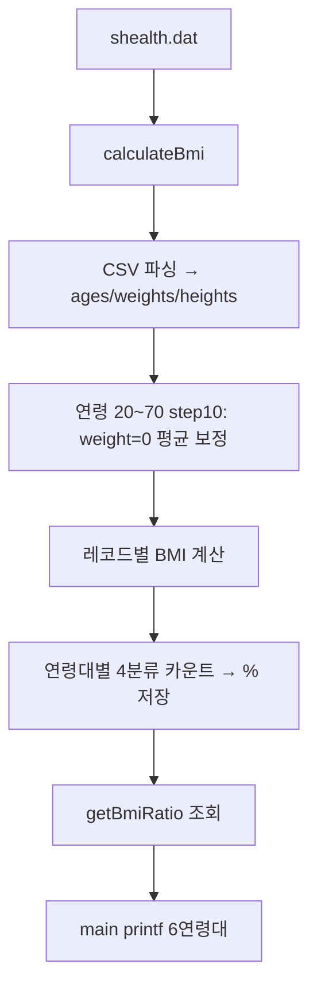

# SHealth BMI — 요구사항 분석서 (Requirements Analysis)

| 항목 | 내용 |
|------|------|
| 문서 버전 | 1.0 |
| 작성일 | 2026-05-20 |
| Step | 02 — 요구사항 분석 |
| 입력 | README.md, CMakeLists.txt, SHealth.h/cpp, SHealthBMI.cpp, shealth.dat, .cursorrules |
| 후속 Step | 03 코드 품질 분석, 04 리팩토링, 05~06 테스트, 08~11 기능 개선 |

---

## 1. 개요

### 1.1 목적

삼성 헬스에서 수집한 사용자 신체 데이터(CSV)를 읽어 **BMI**를 계산하고, **연령대(20~70대, 10년 단위)** 별로 저체중·정상·과체중·비만 **비율(%)**을 산출·출력하는 C++17 콘솔 애플리케이션이다.

### 1.2 이해관계자·범위

| 구분 | 설명 |
|------|------|
| 사용자 | 내부 분석·실습(Activities 1~5) 수행자 |
| 시스템 경계 | 파일 입력(`shealth.dat`) → 메모리 적재 → 보정 → BMI·통계 → stdout / API 조회 |
| 범위 외(현 단계) | DB 연동, GUI, 실시간 스트리밍, 다중 파일 배치 |

### 1.3 용어

| 용어 | 정의 |
|------|------|
| 연령대(age class) | 10년 구간. 코드·출력 기준값: 20, 30, 40, 50, 60, 70 |
| ageClass | 연령대 하한(예: 20 = 20대). 구간 `[ageClass, ageClass + 10)` |
| type (분류 코드) | 100=저체중, 200=정상, 300=과체중, 400=비만 |
| 보정(imputation) | 누락값(0)을 동일 연령대 통계값(평균)으로 대체 |

---

## 2. 기능 요구사항 (Functional Requirements)

### 2.1 현행(As-Is) — Must (유지·검증 대상)

기존 바이너리·API 동작과 README 핵심 시나리오를 만족해야 한다.

| ID | 요구사항 | 상세 | 근거 |
|----|----------|------|------|
| FR-01 | CSV 로드 | 헤더 1행(`id,age,weight,height`) 스킵 후 레코드 파싱 | README, SHealth.cpp |
| FR-02 | BMI 계산 | `BMI = weight(kg) / (height(m))²`, height는 **cm** → m 변환(`/100`) | README |
| FR-03 | 체중 0 보정 | `weight == 0`인 레코드에 **동일 연령대** 내 `weight != 0` 레코드의 **산술 평균** 적용 후 BMI 계산 | README Overview |
| FR-04 | BMI 4분류 | 저체중 / 정상 / 과체중 / 비만 (경계는 §4) | README, bmi.png |
| FR-05 | 연령대별 비율 | age ∈ [20,30), [30,40), …, [70,80) 각각 4분류 **인원 비율(%)** | README, main 출력 |
| FR-06 | 통계 조회 API | `getBmiRatio(ageClass, type)` → 해당 연령대·분류 비율(%) 반환 | SHealth.h |
| FR-07 | 일괄 처리 API | `calculateBmi(filename)` → 로드·보정·BMI·연령대 통계 **일괄 수행**, 처리 레코드 수 반환 | SHealth.h |
| FR-08 | 콘솔 출력 | 20·30·40·50·60·70대 각 1행, 4분류 `%f` 출력 (§6.2) | SHealthBMI.cpp |

### 2.2 README Activities 4 — 향후 기능 (MoSCoW)

| 우선순위 | ID | 요구사항 | 설명 | Step 연계 |
|----------|-----|----------|------|-----------|
| **Must** | — | (위 FR-01~08) | 현행 파이프라인·출력 계약 유지 | 05~09 Golden Master |
| **Should** | FR-S01 | SRP 책임 분리 | 파일 I/O, 보정, BMI, 통계, 조회를 역할별로 분리·리팩토링 | 04, 08 |
| **Should** | FR-S02 | height=0 보정 | 키 누락(0) 시 **동 연령대 평균 키**로 보정 (체중 0 보정과 대칭) | 08~09 |
| **Should** | FR-S03 | 연령대 BMI 분포 API 정비 | “특정 연령대 BMI 분포 비율”을 **명시적·확장 가능한 API**로 제공 (현재는 `getBmiRatio`+24멤버) | 08 |
| **Should** | FR-S04 | 단위 테스트 | BMI·보정·분류·경계·파일 예외 TC, `ctest` Green | 05~06 |
| **Could** | FR-C01 | 정상 BMI 사용자 목록 | BMI가 정상 범위인 사용자 **ID 목록** 조회 | 10 |
| **Could** | FR-C02 | 전체 대비 범주 비율 | 연령대가 아닌 **전체 사용자** 기준 4분류 비율 | 10~11 |
| **Won't (현 릴리스)** | — | 10대·80대 이상 별도 리포트 | README·코드 모두 20~70만 집계; 별도 요구 없음 | 이슈 §7 |

> **Note:** README Activity 4의 “연령대 BMI 분포 비율 추가”는 **비즈니스 기능상 이미 FR-05/FR-06에 존재**한다. MoSCoW에서 Should인 FR-S03은 **품질·API 측면의 정식화·리팩토링**으로 해석한다.

### 2.3 처리 흐름 (As-Is)



---

## 3. 비기능 요구사항 (Non-Functional Requirements)

| ID | 분류 | 요구사항 | 기준 |
|----|------|----------|------|
| NFR-01 | 빌드 | CMake 3.10+, C++17, out-of-source `build/` | CMakeLists.txt |
| NFR-02 | 테스트 | Google Test 1.14 (FetchContent), `gtest_discover_tests`, `ctest` 실행 가능 | CMakeLists.txt |
| NFR-03 | 품질 | Activities 1~2: 코드 스멜 제거, 네이밍·하드코드·중복·전역 제거 | README Activities |
| NFR-04 | 설계 | SOLID·DRY, Magic Number → 상수/enum, 점진적 STL(`vector` 등) **허용** | README 주의사항, .cursorrules |
| NFR-05 | 회귀 | 리팩토링·기능 추가 후 기존 main 출력·TC Green (Golden Master, Step 09) | .cursorrules |
| NFR-06 | 유지보수 | 단계 산출물 `docs/`, 보고 `Report/`, Transcript `Prompting/` | .cursorrules |
| NFR-07 | 성능 | 실습 규모: shealth.dat 약 4,800행, 고정 배열 10,000 — 별도 SLA 없음 | shealth.dat |
| NFR-08 | 보안 | 로컬 CSV만 처리, 비밀 파일 커밋 금지 | .cursorrules |

---

## 4. BMI 분류 및 경계값 정의

### 4.1 공식 (Normative — README)

```
BMI = weight_kg / (height_m)²
height_m = height_cm / 100.0
```

### 4.2 분류 구간 (Normative — README)

| 분류 | README 조건 | 수학적 표기 (권장 해석) |
|------|-------------|-------------------------|
| 저체중 | 18.5 **이하** | BMI ≤ 18.5 |
| 정상체중 | 18.5 **초과**, 23 **미만** | 18.5 < BMI < 23 |
| 과체중 | 23 **이상**, 25 **미만** | 23 ≤ BMI < 25 |
| 비만 | 25 **이상** | BMI ≥ 25 |

**경계값 요약:** 18.5, 23, 25 (단위: kg/m²)

### 4.3 현행 구현(As-Is) vs README

| BMI 값 | README 기대 분류 | `SHealth.cpp` 분기 | 일치 |
|--------|------------------|---------------------|------|
| 18.5 | 저체중 | `<= 18.5` → 저체중 | ○ |
| 18.5 < x < 23 | 정상 | `> 18.5 && < 23` | ○ |
| 23 ≤ x < 25 | 과체중 | `>= 23 && < 25` | ○ |
| 25 | 비만 | `> 25`만 비만 → **과체중** | **×** |
| 25 < x | 비만 | `> 25` | ○ |

→ **결함 후보:** BMI = 25.0 은 README상 비만, 코드상 과체중. Step 07 결함 분석·TC에서 확정·수정.

### 4.4 테스트용 경계 샘플 (Should 검증)

| BMI | 기대 분류 |
|-----|-----------|
| 18.5 | 저체중 |
| 18.5001 | 정상 |
| 22.999 | 정상 |
| 23.0 | 과체중 |
| 24.999 | 과체중 |
| 25.0 | 비만 |
| 25.001 | 비만 |

---

## 5. 입력·출력·데이터 제약

### 5.1 입력 파일

| 항목 | 제약 |
|------|------|
| 경로 | 기본 `shealth.dat` (프로젝트 루트, main 하드코딩) |
| 형식 | CSV, UTF-8 가정, 구분자 `,` |
| 헤더 | 1행 필수: `id,age,weight,height` |
| 필드 | id: 정수(문자열 파싱), age: int, weight·height: double(kg, cm) |
| 레코드 | 헤더 제외 다수 행; 빈 줄 시 **파싱 루프 중단** (`tokens.empty()` break) |
| 최대 건수 | 구현상 **10,000** (`ages[10000]` 등) — 초과 시 미정의(버퍼 오버플로우 위험) |

### 5.2 샘플 데이터 관찰 (`shealth.dat`)

| 패턴 | 관찰 |
|------|------|
| weight=0 | 최소 1건 (예: `93730,57,0,167.6`) — FR-03 보정 대상 |
| height=0 | 샘플 grep 기준 **미발견** — FR-S02 요구만 존재, As-Is 미구현 |
| age 범위 | 20 미만·80 이상 포함 가능(예: age 75, 22 등) — FR-05 집계 구간 밖 레코드는 **통계 분모에 미포함** |

### 5.3 출력

| 채널 | 형식 |
|------|------|
| stdout (main) | 6행 × `{ageClass} - underweight = %f, normal = %f, overweight = %f, obesity = %f\n` |
| stderr | 파일 오픈 실패 시 메시지, `calculateBmi` → **0** 반환 |
| API | 비율은 **백분율 실수**(0~100), 소수 `%f` 그대로 출력 |

### 5.4 연령대 매핑

| ageClass | 연령 조건 (age) | 비고 |
|----------|-----------------|------|
| 20 | 20 ≤ age < 30 | “20대” |
| 30 | 30 ≤ age < 40 | |
| 40 | 40 ≤ age < 50 | |
| 50 | 50 ≤ age < 60 | |
| 60 | 60 ≤ age < 70 | |
| 70 | 70 ≤ age < 80 | |

경계 예: age=19 → 어느 연령대에도 미포함; age=29 → 20대; age=70 → 70대.

### 5.5 체중 0 보정 규칙 (상세)

1. 연령대 `a` = 20, 30, …, 70 각각:
2. 해당 구간에서 `weight != 0`인 레코드만으로 평균 `sum / ageCount` 계산
3. 동 구간 `weight == 0`인 레코드에 평균 대입
4. **예외:** `ageCount == 0`이면 `0/0` → NaN/미정의 (이슈 §7-I02)

---

## 6. API 및 main 출력 계약

### 6.1 공개 API (`SHealth`)

```cpp
int calculateBmi(const std::string& filename);
double getBmiRatio(int ageClass, int type);
```

| 메서드 | 전제조건 | 후조건 | 반환 |
|--------|----------|--------|------|
| `calculateBmi` | 유효 경로 권장 | 내부 배열·통계 멤버 갱신; `count` = 로드 건수 | 성공: 건수 ≥0; 실패(파일): **0**, stderr 로그 |
| `getBmiRatio` | 선행 `calculateBmi` 호출 권장 | (ageClass, type) 조합에 저장된 % | 미지정 조합: **0.0** |

### 6.2 `getBmiRatio` 매개변수 계약

| ageClass | 허용 | type | 의미 |
|----------|------|------|------|
| 20, 30, 40, 50, 60, 70 | 그 외 → 0.0 | 100 | 저체중 % |
| | | 200 | 정상 % |
| | | 300 | 과체중 % |
| | | 400 | 비만 % |

### 6.3 main (`SHealthBMI.cpp`) 출력 계약

**Golden Master 후보 문자열 패턴:**

```
20 - underweight = <float>, normal = <float>, overweight = <float>, obesity = <float>
30 - underweight = ...
...
70 - underweight = ...
```

- 순서: ageClass 오름차순 20 → 70
- 라벨·구두점·공백: 위 패턴 **고정** (리팩토링 시 회귀 테스트 기준)
- `calculateBmi("shealth.dat")` **상대 경로** — 실행 시 CWD에 `shealth.dat` 필요

### 6.4 비공개·구현 결합

- `split(line, ',')` — private, CSV 토큰화
- 24개 `underweight20` … `obesity70` 멤버 — `getBmiRatio`와 강결합 (FR-S01 개선 대상)

---

## 7. 모호·누락·충돌 이슈 목록

| ID | 이슈 | 설명 | 권장 조치 | 우선순위 |
|----|------|------|-----------|----------|
| I-01 | BMI = 25 분류 | README “25 이상” vs 코드 `> 25` | README 기준 `>= 25`로 통일, TC 추가 | P0 |
| I-02 | weight=0 & 동연령대 유효 체중 0건 | `ageCount==0` → 평균 0/0 | 0 유지 또는 스킵·로그; TC 정의 | P0 |
| I-03 | height=0 | README Activity 4만 언급, **미구현**; BMI 무한대/NaN 위험 | FR-S02: 동연령대 평균 키 보정 | P1 |
| I-04 | 연령 10대 미만·80+ | 데이터에 존재 가능, **통계 제외** | 요구 명시: “집계 대상 외”; Could 시 별도 버킷 | P2 |
| I-05 | 빈 연령대 | `sum==0` 시 `%` 계산 `0/0` | 0% 4종 또는 N/A; main/Golden Master 합의 | P1 |
| I-06 | 배열 상한 10,000 | 초과 레코드 미처리 | vector 전환(Should) 또는 명시적 에러 | P2 |
| I-07 | type 코드 100/200/300/400 | 도메인 의미 불명확 | `enum class BmiCategory` (Step 04) | P2 |
| I-08 | `getBmiRatio` 잘못된 인자 | 조용히 0.0 | 테스트·문서화; optional 예외 | P3 |
| I-09 | 파일·CSV 오류 | `stoi`/`stod` 예외, 컬럼 수 불일치 미처리 | Activity 3 예외 TC | P1 |
| I-10 | 비율 합계 | 4분류 합 ≠ 100% (경계·반올림) | 허용 오차 정의 또는 경계 수정 후 100% | P2 |
| I-11 | id 필드 미사용 | FR-C01 목록 기능 시 id 필요 | 파싱 유지·레코드 구조체화 | P3 |
| I-12 | CWD 의존 | `shealth.dat` 상대 경로 | 테스트 fixture 경로·CLI 인자 Could | P3 |

---

## 8. 추적성 매트릭스 (요약)

| README / Activity | 요구 ID |
|-------------------|---------|
| Overview BMI·4분류 | FR-02, FR-04, §4 |
| 체중 0 평균 보정 | FR-03, §5.5 |
| 연령대 통계 | FR-05, FR-06, FR-08 |
| Activity 2 리팩토링 | NFR-03, FR-S01 |
| Activity 3 Unit Test | FR-S04, NFR-02 |
| Activity 4 SRP | FR-S01 |
| Activity 4 연령대 분포 | FR-05, FR-S03 |
| Activity 4 height=0 | FR-S02, I-03 |
| Activity 4 정상 목록 | FR-C01 |
| Activity 4 전체 비율 | FR-C02 |
| STL 허용 | NFR-04 |

---

## 9. 승인·변경 이력

| 버전 | 일자 | 변경 |
|------|------|------|
| 1.0 | 2026-05-20 | Step 02 초안 작성 |

**다음 Step 입력:** 본 문서 + `.cursorrules` → Step 03 `docs/code_quality_analysis.md`
